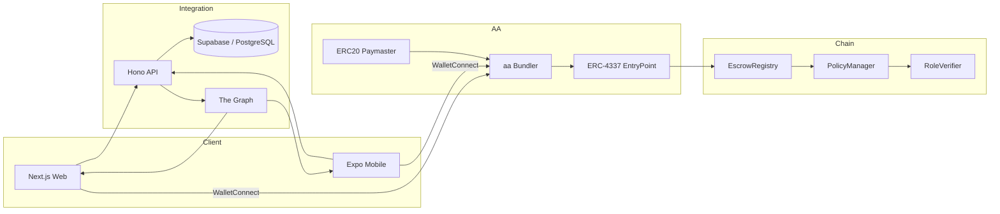

# ファミリー共有ウォレット 技術設計書

## 1. システム全体設計

### 1.1 アーキテクチャ概要

- **チェーン**: Base Mainnet（L2, EVM）
- **コントラクト**: EscrowRegistry (主), PolicyManager, RoleVerifier, ERC20Paymaster, GuardianModule
- **クライアント**: Next.js 15 (Web), Expo SDK 52 (Mobile)
- **API**: Hono (TypeScript) on Cloudflare Workers, Drizzle + Supabase/PostgreSQL
- **連携サービス**: ERC-4337 Bundler, Paymaster (USDC/JPYC), The Graph Subgraph, Expo Push Notification, WalletConnect v2, Tsumiki 開発フロー



### 1.2 モジュール構成

1. **On-Chain モジュール**
   - EscrowRegistry: エスクロー登録/承認/リリース/キャンセルの中心コントラクト。
   - PolicyManager: 各 vault のポリシー（閾値/タイムロック/rolesRoot/ownersRoot）管理。
   - RoleVerifier: Merkle Proof を検証しロール/メンバーを認証。
   - ERC20Paymaster: USDC/JPYC によるガススポンサリング。
   - GuardianModule: ソーシャルリカバリ/緊急停止/デバイス更新など。

2. **API モジュール** (Hono)
   - Vault Controller: グループ/Vault 管理。
   - Escrow Controller: エスクロー CRUD とステータス取得。
   - Policy Controller: Policy の編集・監査。
   - Notification Controller: Push 通知 & Webhook。
   - Integration Services: Bundler/Paymaster/Subgraph との通信。

3. **Web Client**
   - ダッシュボード、エスクロー詳細、ポリシー設定、タイムライン、ユーザー設定。
   - wagmi v2 + viem + permissionless SDK。
   - React Query & Zustand による状態管理。

4. **Mobile Client**
   - Expo Router、React Query、WalletConnect React Native SDK。
   - Push 通知、QR スキャン、オフラインキャッシュ。

5. **Shared Package**
   - TypeScript 型定義、ユーティリティ、GraphQL クエリ、i18n、コンスタント。

6. **開発プロセス**
   - `tsumiki` の @kairo / @tdd / @rev コマンドで仕様同期・テスト記録。

## 2. スマートコントラクト設計

### 2.1 EscrowRegistry

| 項目 | 内容 |
| ---- | ---- |
| 役割 | エスクローの登録・承認・リリース・キャンセル・ポリシー連携 |
| 重要ストレージ | `mapping(bytes32 => Escrow)` `mapping(bytes32 => PolicyBinding)` `mapping(bytes32 => ApprovalState)` |
| 採用パターン | Upgradeable Proxy（UUPS）、カスタムエラー、イベント Emission |

```solidity
struct Escrow {
    bytes32 vaultId;
    address payer;
    address payee;
    address token; // address(0) for native
    uint256 amount;
    address target;
    bytes data;
    bytes32 policyId;
    uint48  deadline;
    EscrowStatus status;
}

struct ApprovalState {
    uint48 createdAt;
    uint48 lastActionAt;
    uint8 approvalsCount;
    mapping(bytes32 => bool) hasApproved; // hashed approver identifier
}
```

**主要関数**
- `createEscrow(CreateParams calldata params)`
- `approveRelease(bytes32 escrowId, bytes calldata proof)`
- `revokeApproval(bytes32 escrowId, bytes calldata proof)`
- `release(bytes32 escrowId, bytes calldata proof)`
- `cancel(bytes32 escrowId, bytes calldata proof)`
- `updatePolicyBindings(bytes32 escrowId, bytes32 newPolicyId)`

**ガードロジック**
- `PolicyManager.getPolicy(policyId)` を呼び出し閾値/タイムロック/rolesRoot を取得。
- `RoleVerifier.verify(proof, rolesRoot, approverHash)`でロール証明。
- `require(block.timestamp >= timelockEnd)` と `approvalsCount >= threshold` を検証。
- `deadline` 超過時は `cancel` のみ許可。

### 2.2 PolicyManager

- Policy データのバージョニング v1.
- `struct Policy { uint8 threshold; uint32 timelock; bytes32 rolesRoot; bytes32 ownersRoot; }`
- `createPolicy`, `updatePolicy`, `schedulePolicyUpdate`, `finalizePolicyUpdate` 等、タイムロックを含む二段階更新。
- Guardian 認定により緊急変更が可能。

### 2.3 RoleVerifier

- `verifyRole(bytes32 leaf, bytes32[] calldata proof, bytes32 root)`
- keccak256(abi.encodePacked(account, role)) を leaf として Merkle 証明。

### 2.4 ERC20Paymaster

- ERC-4337 EntryPoint 向け Paymaster。
- 承認フロー: `validatePaymasterUserOp` → トークン残高チェック → スポンサー決定。
- ガス支払い: 事前にデポジットした USDC/JPYC を EntryPoint に供給。
- トークン換算: `priceOracle` を接続（Chainlink or 内部レート）。

### 2.5 GuardianModule

- 凍結、リカバリ、所有者再発行。
- `initiateRecovery(bytes32 vaultId, address newAccount, Proof proof)` → タイムロック → `completeRecovery`。

### 2.6 イベント一覧

| コントラクト | イベント | 説明 |
| ------------- | -------- | ---- |
| EscrowRegistry | `EscrowCreated`, `EscrowApproved`, `EscrowReleased`, `EscrowCancelled`, `EscrowExpired` | UI/サブグラフ連携用 |
| PolicyManager  | `PolicyCreated`, `PolicyUpdated`, `PolicyUpdateScheduled` | ポリシー監査ログ |
| Paymaster      | `SponsorshipGranted`, `SponsorshipRejected` | ガススポンサー監査 |
| GuardianModule | `RecoveryInitiated`, `RecoveryCompleted`, `EmergencyFreeze` | 緊急操作可視化 |

## 3. オフチェーン設計

### 3.1 Hono API

**ランタイム**: Cloudflare Workers + TypeScript + Hono 4.x + Drizzle ORM。

| Route | メソッド | 概要 |
| ----- | ------ | ---- |
| `/vaults` | GET/POST | Vault の取得/作成 |
| `/vaults/:id/members` | GET/POST/DELETE | メンバー管理 |
| `/vaults/:id/invites` | GET/POST/DELETE | 招待リンク生成・失効管理 |
| `/escrows` | GET/POST | Escrow 一覧取得/ドラフト登録 |
| `/escrows/:id` | GET | Escrow 詳細（オンチェーン + Supabase スナップショット）|
| `/escrows/:id/timeline` | GET | 承認/コメント/通知ログ |
| `/policies` | GET/POST | Policy 参照・変更要求 |
| `/notifications` | POST | Push 通知トリガー |
| `/paymaster/sponsor` | POST | Sponsorship API（フロント→API→Paymaster）|

**サービスレイヤー**
- EscrowService: サブグラフ参照、Supabase キャッシュ更新。
- PolicyService: Policy 操作履歴保存。
- TimelineService: 承認ステップ、コメント、UserOperation ハッシュ追跡。
- InviteService: 招待トークン生成・署名・失効、Vault メンバー登録のドラフト作成。
- PaymasterService: Sponsorship リクエスト、失敗時の fallback。

**データベース**
- Drizzle Schema: vaults, members, policies, invites, escrows_snapshot, approvals, notifications。
- Supabase Auth/Storage を用いたファイル（証憑、請求書等）アップロード。

### 3.2 サブグラフ設計

- **Namespace**: `family-wallet/base`
- Data Sources: EscrowRegistry, PolicyManager, Paymaster。
- Entities: `Vault`, `Escrow`, `Approval`, `PolicyVersion`, `Sponsorship`。
- ハンドラ: `handleEscrowCreated`, `handleEscrowApproved`, `handlePolicyUpdated`。

### 3.3 Bundler/Paymaster 連携

- `permissionless` SDK をラップした `AaClient`（Web/Mobile 共通）。
- Sponsorship フロー: クライアント → Hono `/paymaster/sponsor` → Paymaster RPC → Bundler。
- 失敗時は API が `fallbackMode: true` を返し、UI で ETH ガスを選択。

### 3.4 通知システム

- Expo Push Notification: Mobile 向け。
- Web Push（Service Worker）: Escrow 状態変化、緊急通知。
- 重要イベントは TimelineService 経由でログに記録。

### 3.5 開発フロー自動化

- `npm run agents:sync`: tsumiki コマンド同期。
- `npm run specs:sync -- --project family_wallet`: requirements/design/tasks の同期。
- `@kairo-*` コマンドログは `.kiro/logs/` に保存し、PR に添付。

## 4. クライアント設計

### 4.1 Web アプリ

- **UI Framework**: shadcn/ui + TailwindCSS。
- **状態管理**: React Query（非同期データ）、Zustand（ローカル状態）、Jotai（モーダル）。
- **主要ページ/モジュール**
  - `/` Dashboard: Vault 概要、承認待ち、直近アクティビティ、招待バナー。
  - `/escrows/[id]`: 詳細、承認/拒否、タイムライン、閾値進捗バー。
  - `/policies`: Policy 一覧、編集モーダル、招待ポリシー設定。
  - `/settings`: Group Settings（メンバー管理、招待一覧、QR 再発行）。
  - Approvals Hub: 同期/非同期署名タブ、ライブセッション開始、重みゲージ、Deadline 表示。
  - Group Creation & Invite: ロール/weight プリセット、EIP-712 招待生成、QR/リンク表示。
  - Escrow Release Console: Ready / Awaiting 条件リスト、`release()` 実行ボタン、解除条件ステータス。
- **Figma リファレンス**: `docs/design/figma` v8.0 のワイヤーフレームに従い、ロール別 CTA、Threshold Progress、Invite Card、Approvals List Item を shadcn コンポーネントで再現する。`loading`/`error`/`empty` の各状態は Skeleton/Alert/Empty State を使い分ける。
- **カスタムフック/ユーティリティ**
  - `useAaClient`：permissionless クライアント生成。
  - `useEscrowActions`：approve/release/cancel の UserOperation 生成。
  - `usePolicyEditor`：Policy 更新ワークフロー。
  - `useApprovalsHub`：閾値進捗計算、同期/非同期タブ切り替え。
  - `useInviteManager`：招待生成・失効 API 呼び出し、QR/リンク生成。
- **エラー処理/ステータス表示**
  - `EscrowErrorBoundary`：UserOperation エラーを捕捉しユーザーに提示。
  - `GasSponsorBanner`：Paymaster 状態表示。
  - `LiveSessionToast`：ライブ承認セッションの参加/離脱を通知。

### 4.2 モバイルアプリ

- **Navigation**: Expo Router。
- **主要画面**
  - Home: 承認待ちサマリ、招待バナー、最新通知。
  - Approvals: 承認待ちリスト、同期/非同期切替、Sponsor チェック。
  - Timeline: Escrow 履歴、閾値進捗バー、コメント。
  - Group: メンバー/ロール/重み表示、Invite Builder、招待ステータス。
  - Settings: WalletConnect、Push 設定、端末登録。
- **Figma リファレンス**: `docs/design/figma/src/components/wallet/MobileView.tsx` で定義された Bottom Tabs（Home / Scan / Timeline / Settings）とバッジ表示、Expo Push 設定フローをベースとする。WalletConnect セッション切断・Scan リトライ・通知未読バッジなどの状態パターンをそのまま Expo 実装に落とし込む。
- **フック**
  - `useWalletConnect`：セッション管理。
  - `useUserOperation`：UserOperation build/send。
  - `useOfflineCache`：AppStorage でオフライン保管。
  - `useMobileInvites`：招待一覧取得、CTA バナー表示ロジック。
- **プラットフォーム連携**
- Push 通知（Expo Notifications）。
- 生体認証（expo-local-authentication）で追加承認。

## 更新サマリ (2025-09-29)
- 招待 API (`/vaults/:id/invites`) と InviteService/`invites` テーブルを設計に追加し、グループ招待フローを明示。
- Web クライアントに Approvals Hub、Group Creation & Invite、Escrow Release Console を設計追加し、Figma v8.0 のコンポーネント仕様に合わせたフック/ステータス処理を記載。
- モバイルクライアントのナビゲーションを Home/Approvals/Timeline/Group/Settings の 5 タブ構成に更新し、招待バナー・Invite Builder 等の要件を反映。

## 5. Shared パッケージ設計

- `packages/shared/src/types`：Escrow/Policy/Vault/Notification 型定義（requirements に記載した型の実体）。
- `packages/shared/src/constants`：CONTRACT_ADDRESSES, CHAIN_CONFIG, POLICY_LIMITS。
- `packages/shared/src/abis`：EscrowRegistry, PolicyManager, Paymaster, EntryPoint の ABI。
- `packages/shared/src/lib/escrow-helpers.ts`：承認状態計算、timelock 判定。
- `packages/shared/src/lib/merkle.ts`：rolesRoot 用 Merkle 証明生成。
- `packages/shared/src/lib/tsumiki.ts`：tsumiki コマンドのラッパー関数（CLI 呼び出し補助）。

## 6. セキュリティ設計

- 単体テスト: reentrancy, signature replay, timelock bypass。
- Guard: `nonReentrant`、`EIP712Domain` 署名検証。
- Upgrade 管理: Proxy Admin を GuardianModule が保持、Emergency Freeze でアップグレード停止。
- Multisig: ヘルスチェック/アップグレードは 3-of-5 threshold。
- モニタリング: Forta/EigenPhi などの監視サービス連携を検討。

## 7. テスト計画詳細

### 7.1 Foundry テスト

- `EscrowRegistry.t.sol`: create→approve→release、timelock、deadline。
- `PolicyManager.t.sol`: policy update scheduling、rolesRoot 更新。
- `Paymaster.t.sol`: sponsorship success/failure、spend limit。
- ガスベンチ: approvalsCount/threshold 別のコスト測定。

### 7.2 API テスト

- Vitest+Hono テストベンチ。
- Supabase をローカルモック。
- ミドルウェア: 認証、デバイス署名検証。

### 7.3 クライアントテスト

- Web: React Testing Library + Playwright。
- Mobile: RTL + Detox。
- Snapshot/Visual Regression: Chromatic or Storybook。

### 7.4 Tsumiki/TDD

- `@tdd-testcases` により E2E テストケースを定義、`@tdd-red` `@tdd-green` のログ保存。
- CI: GitHub Actions で `pnpm lint`, `pnpm test`, `pnpm build`, `forge test` を実行。

## 8. 運用・監視

- アラート: Paymaster スポンサー率、Escrow 失敗率、Bundler レイテンシ。
- メトリクス: Prometheus 互換エンドポイント（Workers から PushGateway）。
- ログ: Cloudflare Workers Logpush、Supabase Logflare。
- インシデント対応: GuardianModule で緊急停止 → フォールバックポリシー。

## 9. 依存関係とバージョン

| 領域 | 主要パッケージ | バージョン |
| ---- | -------------- | ---------- |
| On-Chain | Solidity | ^0.8.24 |
| On-Chain | OpenZeppelin Contracts | ^5.0.0 |
| On-Chain | Foundry | 最新安定版 |
| Web | Next.js | 15.x |
| Web | React | 18.x |
| Web | wagmi | 2.x |
| Web | viem | 2.x |
| Mobile | Expo SDK | 52.x |
| Mobile | React Native | 0.75.x |
| API | Hono | 4.x |
| API | Drizzle ORM | 0.30.x |
| Shared | pnpm | 9.x |
| Dev | Tsumiki | 最新安定版 |

## 10. 実装ガイドライン

- コーディング規約は AGENTS.md を遵守、型安全性とコメント記法を適用。
- Biome による整形と lint を pre-commit hook に設定。
- `tsumiki` ログも PR に添付し、仕様との整合性を監査可能にする。
- 重要な設計変更は `.kiro/specs/family_wallet/` のドキュメントを更新し承認を得てから実装する。
