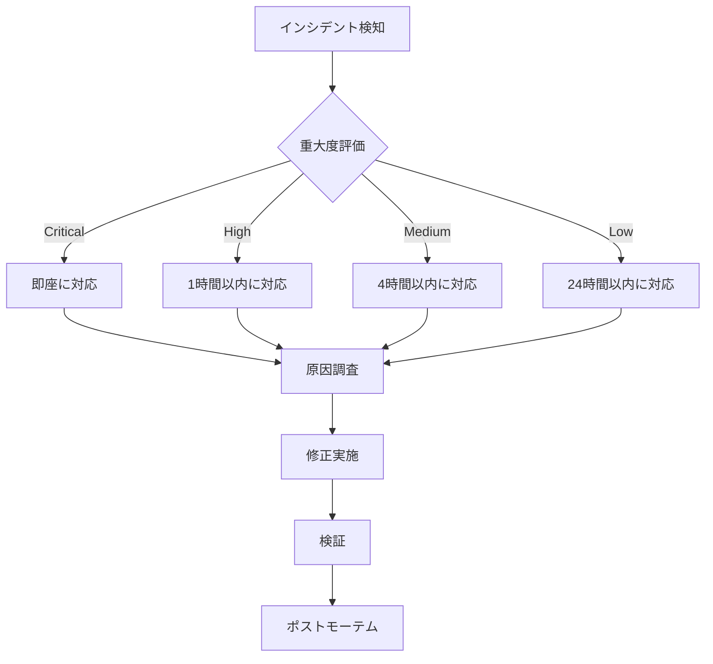

# Family Wallet - 監視・運用ガイド

## 概要

本番環境での監視・運用に関するガイドラインとベストプラクティスです。

## 1. 監視対象

### 1.1 API (Cloudflare Workers)

#### メトリクス

| メトリクス | しきい値 | アクション |
|---------|--------|----------|
| エラー率 | > 5% | アラート発火 |
| レスポンスタイム | > 1000ms (P95) | パフォーマンス調査 |
| CPU使用時間 | > 50ms (平均) | 最適化検討 |
| リクエスト数 | - | トレンド分析 |

#### ヘルスチェック

```bash
# 定期ヘルスチェック (5分間隔)
curl https://your-api-domain.workers.dev/health

# 期待されるレスポンス
{"ok":true,"mockMode":false}
```

### 1.2 Web (Vercel)

#### Core Web Vitals

| メトリクス | 目標値 | しきい値 |
|---------|-------|--------|
| LCP (Largest Contentful Paint) | < 2.5s | < 4.0s |
| FID (First Input Delay) | < 100ms | < 300ms |
| CLS (Cumulative Layout Shift) | < 0.1 | < 0.25 |
| TTFB (Time to First Byte) | < 600ms | < 1000ms |

#### アクセシビリティ

- Lighthouse スコア: > 90
- キーボードナビゲーション: 完全対応
- スクリーンリーダー: 対応済み

### 1.3 Database (Neon)

#### メトリクス

| メトリクス | しきい値 | アクション |
|---------|--------|----------|
| 接続数 | > 80% | 接続プール調整 |
| クエリ実行時間 | > 1000ms | インデックス最適化 |
| ストレージ使用量 | > 80% | 容量拡張検討 |
| CPU使用率 | > 70% | スケーリング検討 |

### 1.4 Smart Contracts (Base Sepolia)

#### 監視項目

- ガス価格トレンド
- トランザクション成功率
- コントラクトイベント
- 異常なトランザクションパターン

## 2. ログ管理

### 2.1 API ログ

#### ログレベル

```typescript
// apps/api/src/honoApp.ts
console.log('[info] Normal operation')
console.warn('[warn] Warning message')
console.error('[error] Error occurred', error)
```

#### ログフォーマット

```json
{
  "timestamp": "2025-10-04T12:00:00Z",
  "level": "error",
  "message": "Database connection failed",
  "context": {
    "userId": "user123",
    "endpoint": "/api/vaults",
    "error": "Connection timeout"
  }
}
```

#### ログ確認

```bash
# リアルタイムログ
wrangler tail

# フィルタリング
wrangler tail --status error
```

### 2.2 Web ログ

#### クライアントサイドエラートラッキング

```typescript
// apps/web/src/lib/error-tracking.ts
window.addEventListener('error', (event) => {
  // エラーをログサービスに送信
  console.error('Client error:', event.error)
})

window.addEventListener('unhandledrejection', (event) => {
  console.error('Unhandled promise rejection:', event.reason)
})
```

#### Vercel ログ確認

```bash
# デプロイログ
vercel logs <DEPLOYMENT_URL>

# リアルタイム
vercel logs --follow
```

## 3. アラート設定

### 3.1 Cloudflare Workers アラート

#### 設定手順

1. Cloudflare Dashboard > Notifications
2. "Add" をクリック
3. 以下のアラートを設定:

##### エラー率アラート

- **条件**: Error rate > 5%
- **期間**: 5 minutes
- **通知先**: Email, Slack

##### CPU時間アラート

- **条件**: CPU time > 50ms (average)
- **期間**: 5 minutes
- **通知先**: Email

### 3.2 Vercel アラート

#### 設定手順

1. Vercel Dashboard > Settings > Notifications
2. 以下を有効化:

- **Deployment Failed**: デプロイ失敗時
- **Build Error**: ビルドエラー発生時
- **Performance Degradation**: パフォーマンス低下時

### 3.3 Database アラート

#### Neon Dashboard

1. Neon Console > Project Settings > Alerts
2. 以下のアラートを設定:

- **High CPU Usage**: > 70%
- **Storage Full**: > 80%
- **Connection Limit**: > 80%

## 4. パフォーマンス最適化

### 4.1 API最適化

#### データベースクエリ

```typescript
// ❌ N+1 クエリを避ける
const vaults = await db.select().from(vaults)
for (const vault of vaults) {
  const policies = await db.select().from(policies).where(eq(policies.vaultId, vault.id))
}

// ✅ JOIN を使用
const vaultsWithPolicies = await db
  .select()
  .from(vaults)
  .leftJoin(policies, eq(vaults.id, policies.vaultId))
```

#### キャッシング

```typescript
// Cloudflare KV を使用したキャッシング
const cached = await env.CACHE.get('key')
if (cached) return JSON.parse(cached)

const data = await fetchData()
await env.CACHE.put('key', JSON.stringify(data), { expirationTtl: 300 })
```

### 4.2 Web最適化

#### コード分割

```typescript
// Dynamic import
const HeavyComponent = lazy(() => import('./HeavyComponent'))

function App() {
  return (
    <Suspense fallback={<Loading />}>
      <HeavyComponent />
    </Suspense>
  )
}
```

#### 画像最適化

```typescript
// 適切なサイズと形式

```

## 5. セキュリティ監視

### 5.1 異常検知

#### 監視項目

- 短時間での大量リクエスト (DDoS)
- 不正なトークン使用 (Authentication)
- 異常な送金パターン (Smart Contract)
- SQL Injection 試行 (Database)

#### 対策

```typescript
// レート制限
import { Ratelimit } from '@upstash/ratelimit'

const ratelimit = new Ratelimit({
  redis: env.REDIS,
  limiter: Ratelimit.slidingWindow(10, '10 s'),
})

const { success } = await ratelimit.limit(identifier)
if (!success) return c.json({ error: 'Rate limit exceeded' }, 429)
```

### 5.2 セキュリティヘッダー

```typescript
// apps/web/vercel.json
{
  "headers": [
    {
      "source": "/(.*)",
      "headers": [
        { "key": "X-Content-Type-Options", "value": "nosniff" },
        { "key": "X-Frame-Options", "value": "DENY" },
        { "key": "X-XSS-Protection", "value": "1; mode=block" },
        { "key": "Referrer-Policy", "value": "strict-origin-when-cross-origin" },
        {
          "key": "Content-Security-Policy",
          "value": "default-src 'self'; script-src 'self' 'unsafe-inline'; style-src 'self' 'unsafe-inline';"
        }
      ]
    }
  ]
}
```

## 6. バックアップ戦略

### 6.1 データベースバックアップ

#### 自動バックアップ (Neon)

- **頻度**: 毎日
- **保持期間**: 7日間 (Free tier)、30日間 (Pro tier)
- **リストア**: Point-in-Time Recovery (PITR)

#### 手動バックアップ

```bash
#!/bin/bash
# backup.sh

DATE=$(date +%Y%m%d_%H%M%S)
BACKUP_FILE="backup_${DATE}.sql"

# バックアップ実行
pg_dump $DATABASE_URL > $BACKUP_FILE

# S3 にアップロード (オプション)
aws s3 cp $BACKUP_FILE s3://your-bucket/backups/

# ローカルバックアップは7日間保持
find . -name "backup_*.sql" -mtime +7 -delete
```

### 6.2 設定ファイルバックアップ

```bash
# Git で管理
git add .
git commit -m "Backup configuration"
git push origin main

# 重要なファイル
# - wrangler.toml
# - vercel.json
# - .env.example
# - hardhat.config.ts
```

## 7. インシデント対応

### 7.1 対応フロー



### 7.2 エスカレーション

| 重大度 | 影響範囲 | 対応時間 | 担当 |
|-------|---------|---------|-----|
| Critical | サービス全停止 | 即座 | On-call Engineer |
| High | 主要機能停止 | 1時間 | Dev Team Lead |
| Medium | 一部機能停止 | 4時間 | Developer |
| Low | 軽微な問題 | 24時間 | Developer |

### 7.3 ポストモーテムテンプレート

```markdown
# インシデントレポート - [タイトル]

## 概要
- **発生日時**: 2025-10-04 12:00:00 UTC
- **重大度**: High
- **影響範囲**: API レスポンス遅延

## タイムライン
- 12:00 - アラート発火
- 12:05 - 調査開始
- 12:15 - 原因特定
- 12:30 - 修正デプロイ
- 12:35 - 復旧確認

## 根本原因
データベース接続プールの枯渇

## 対応内容
接続プール設定を調整 (max: 10 -> 20)

## 再発防止策
- [ ] モニタリング強化
- [ ] アラートしきい値調整
- [ ] ドキュメント更新
```

## 8. 定期メンテナンス

### 8.1 日次タスク

- [ ] ヘルスチェック確認
- [ ] エラーログレビュー
- [ ] パフォーマンスメトリクス確認

### 8.2 週次タスク

- [ ] バックアップ検証
- [ ] セキュリティアップデート確認
- [ ] 依存関係更新
- [ ] パフォーマンストレンド分析

### 8.3 月次タスク

- [ ] インフラコスト分析
- [ ] セキュリティ監査
- [ ] ディザスタリカバリテスト
- [ ] ドキュメント更新

## 9. ツールとダッシュボード

### 9.1 監視ダッシュボード

#### Cloudflare Dashboard

- **URL**: https://dash.cloudflare.com/
- **監視項目**: Workers Analytics, Errors, CPU Time

#### Vercel Dashboard

- **URL**: https://vercel.com/dashboard
- **監視項目**: Deployments, Analytics, Web Vitals

#### Neon Console

- **URL**: https://console.neon.tech/
- **監視項目**: Database Metrics, Connections, Storage

### 9.2 推奨ツール

| 用途 | ツール | 目的 |
|-----|-------|-----|
| APM | Datadog / New Relic | アプリケーション監視 |
| ログ管理 | Logtail / Papertrail | ログ集約・検索 |
| エラートラッキング | Sentry | エラー監視 |
| アップタイム監視 | UptimeRobot / Pingdom | 可用性監視 |
| セキュリティ | Snyk | 脆弱性スキャン |

## 10. 連絡先・エスカレーション

### 10.1 緊急連絡先

```yaml
On-Call Engineer:
  - Name: [担当者名]
  - Email: oncall@example.com
  - Phone: +81-XX-XXXX-XXXX

Dev Team Lead:
  - Name: [担当者名]
  - Email: lead@example.com
  - Phone: +81-XX-XXXX-XXXX
```

### 10.2 外部サービスサポート

- **Cloudflare**: https://support.cloudflare.com/
- **Vercel**: https://vercel.com/support
- **Neon**: https://neon.tech/docs/introduction/support
- **Alchemy**: https://www.alchemy.com/support

---

**最終更新**: 2025-10-04
