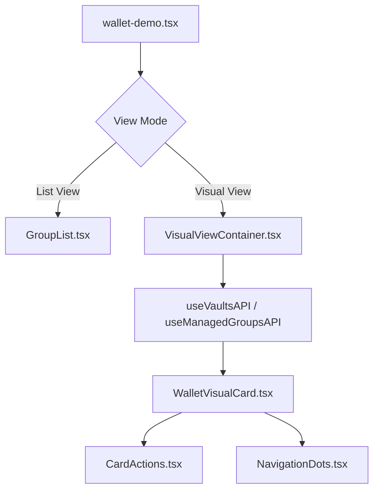

# My Team & Managed Teams ビジュアルビュー開発プラン

## 概要

newdesign/Web3 Wallet Interface Design のデザインコンセプトを活用し、現在のサイトに「My Team」と「Managed Teams」のビジュアルビュー機能を追加します。既存の機能はそのまま維持し、新しいビューモードとして実装します。

---

## デザイン分析

### 参照デザインの主要な特徴

#### 1. カードベースのUI
- **フルスクリーンカード**: 各ウォレットが1画面を占有
- **垂直スクロール**: スワイプまたはスクロールでカード間を移動
- **スナップポイント**: 各カードに自動吸着

#### 2. ビジュアル要素
- **背景画像**: Unsplashからの動的な画像
- **グラデーションオーバーレイ**: 視認性を高める多層グラデーション
- **アニメーション**: Framer Motionによる滑らかな遷移効果
- **ガラスモーフィズム**: backdrop-blurを使った半透明UI

#### 3. インタラクション
- **ダブルタップ**: いいね機能（Instagramライク）
- **コピー機能**: アドレスのワンタップコピー
- **ナビゲーションドット**: 現在位置の視覚的表示
- **アクションボタン**: 固定位置のCTA

#### 4. 情報表示
- **総額表示**: 大きく目立つUSDC残高
- **メンバーアバター**: DiceBearsによる動的アバター
- **ウォレットタイプバッジ**: Team Pay / Leader Pay の識別
- **統計情報**: 取引数、最終アクティビティ、役割

---

## 実装方針

### アーキテクチャ設計

```
apps/web/src/
├── components/
│   └── wallet/
│       ├── visual-view/                    # 新規追加
│       │   ├── VisualViewContainer.tsx     # メインコンテナ
│       │   ├── WalletVisualCard.tsx        # カード表示
│       │   ├── CardActions.tsx             # アクションボタン
│       │   ├── NavigationDots.tsx          # ナビゲーション
│       │   └── index.ts                    # エクスポート
│       ├── GroupList.tsx                   # 既存（変更なし）
│       ├── ManagedGroupList.tsx            # 既存（変更なし）
│       └── ...
└── pages/
    └── wallet-demo.tsx                     # ビューモード切り替え追加
```

### データフロー



---

## 実装タスク

### Phase 1: デザイン分析とコンポーネント設計 ✅ （現在のタスク）

**目標**: デザインファイルの分析と実装方針の策定

**成果物**:
- デザイン分析ドキュメント（本ドキュメント）
- コンポーネント設計図
- データモデル定義

**技術要件**:
- 既存のデザインシステムとの整合性確保
- Shadcn/UIコンポーネントの再利用
- TailwindCSSクラスの一貫性

---

### Phase 2: ビジュアルビューコンポーネントの実装

**目標**: カードベースのビジュアルビューコンポーネントを作成

#### 2.1 VisualViewContainer.tsx

```typescript
interface VisualViewContainerProps {
  vaults: Vault[];
  type: 'my-team' | 'managed-team';
  onCardAction?: (action: string, vaultId: string) => void;
}
```

**実装内容**:
- スクロールコンテナの実装
- スナップポイントの設定
- 現在のカードインデックス管理
- スクロールイベントハンドリング

#### 2.2 WalletVisualCard.tsx

```typescript
interface WalletVisualCardProps {
  vault: Vault;
  type: 'team' | 'leader';
  members: Member[];
  collections?: Collection[];
  onDoubleClick?: () => void;
}
```

**実装内容**:
- フルスクリーンカードレイアウト
- 背景画像とグラデーション
- ガラスモーフィズムUI
- メンバーアバター表示
- 統計情報表示

#### 2.3 CardActions.tsx

```typescript
interface CardActionsProps {
  vaultId: string;
  members: number;
  weight: number;
  totalValueUSDC: string;
  onAction: (action: 'deposit' | 'withdraw' | 'invite') => void;
}
```

**実装内容**:
- 固定位置のアクションボタン
- Deposit / Withdraw / Invite 機能
- 現在のウォレット情報表示

#### 2.4 NavigationDots.tsx

```typescript
interface NavigationDotsProps {
  total: number;
  current: number;
  onNavigate?: (index: number) => void;
}
```

**実装内容**:
- ドットナビゲーション
- 現在位置のハイライト
- クリック/タップでの移動

---

### Phase 3: 既存データとの統合

**目標**: 既存のAPIとデータ構造との連携

#### 3.1 データアダプター実装

```typescript
// hooks/useVisualViewData.ts
export function useVisualViewData(type: 'my-team' | 'managed-team') {
  const { data: vaults } = useVaultsAPI();
  const { data: managedGroups } = useManagedGroupsAPI();

  // データを VisualView 用に変換
  return useMemo(() => {
    const source = type === 'my-team' ? vaults : managedGroups;
    return source?.map(vault => ({
      ...vault,
      image: generateImageUrl(vault),
      gradient: generateGradient(vault.id),
      memberSeeds: vault.members.map(m => `${vault.id}-${m.address}`),
      type: vault.collections ? 'leader' : 'team',
    }));
  }, [vaults, managedGroups, type]);
}
```

#### 3.2 画像生成ロジック

```typescript
// utils/imageGenerator.ts
export function generateImageUrl(vault: Vault): string {
  // Unsplash API または Placeholder 画像
  const keywords = vault.name.toLowerCase().split(' ');
  return `https://images.unsplash.com/photo-...?${keywords.join('+')}`;
}

export function generateGradient(vaultId: string): string {
  // ウォレットIDからハッシュ生成し、一貫したグラデーション
  const gradients = [
    'from-purple-900/60 via-pink-900/40 to-transparent',
    'from-blue-900/60 via-cyan-900/40 to-transparent',
    'from-emerald-900/60 via-teal-900/40 to-transparent',
    'from-orange-900/60 via-red-900/40 to-transparent',
    'from-indigo-900/60 via-violet-900/40 to-transparent',
  ];
  const hash = hashCode(vaultId);
  return gradients[Math.abs(hash) % gradients.length];
}
```

---

### Phase 4: アニメーション・インタラクションの実装

**目標**: Framer Motionを使った滑らかなアニメーション

#### 4.1 カード遷移アニメーション

```typescript
const cardVariants = {
  initial: { opacity: 0, scale: 0.9 },
  animate: { opacity: 1, scale: 1 },
  exit: { opacity: 0, scale: 0.9 },
};

const staggerChildren = {
  animate: {
    transition: {
      staggerChildren: 0.1,
    },
  },
};
```

#### 4.2 ダブルタップ機能

```typescript
const handleDoubleTap = () => {
  if (!liked) {
    setLiked(true);
    setLikeCount(prev => prev + 1);
    // API呼び出し: いいね機能（オプション）
  }
};
```

#### 4.3 スクロールインジケーター

```typescript
{currentCard === 0 && (
  <motion.div
    className="fixed bottom-10 left-1/2 -translate-x-1/2 z-20"
    initial={{ opacity: 0, y: -10 }}
    animate={{ opacity: 1, y: 0 }}
  >
    <ChevronDown className="animate-bounce" />
  </motion.div>
)}
```

---

### Phase 5: レスポンシブ対応とモバイル最適化

**目標**: デスクトップとモバイルの両方で最適な体験

#### 5.1 ブレークポイント設計

```typescript
const breakpoints = {
  mobile: '< 768px',    // 縦向きスクロール
  tablet: '768-1024px', // 縦向きスクロール + サイドパネル
  desktop: '> 1024px',  // 横2列または3列グリッド
};
```

#### 5.2 タッチジェスチャー

```typescript
import { useSwipeable } from 'react-swipeable';

const handlers = useSwipeable({
  onSwipedUp: () => navigateNext(),
  onSwipedDown: () => navigatePrevious(),
  preventScrollOnSwipe: true,
});
```

#### 5.3 パフォーマンス最適化

```typescript
// 仮想化スクロール（大量データ対応）
import { Virtuoso } from 'react-virtuoso';

<Virtuoso
  data={vaults}
  itemContent={(index, vault) => (
    <WalletVisualCard key={vault.id} {...vault} />
  )}
/>
```

---

### Phase 6: テストと動作確認

**目標**: 品質保証と動作検証

#### 6.1 ユニットテスト

```typescript
// __tests__/components/visual-view/WalletVisualCard.test.tsx
describe('WalletVisualCard', () => {
  it('renders vault information correctly', () => {
    // テストロジック
  });

  it('handles double tap interaction', () => {
    // テストロジック
  });

  it('displays member avatars', () => {
    // テストロジック
  });
});
```

#### 6.2 インテグレーションテスト

```typescript
// __tests__/visual-view-integration.test.tsx
describe('Visual View Integration', () => {
  it('switches between list and visual view', () => {
    // テストロジック
  });

  it('loads vault data correctly', () => {
    // テストロジック
  });
});
```

#### 6.3 E2Eテスト

```typescript
// e2e/visual-view.spec.ts
test('complete visual view flow', async ({ page }) => {
  // 1. Navigate to wallet demo
  // 2. Switch to visual view
  // 3. Scroll through cards
  // 4. Interact with actions
  // 5. Verify data display
});
```

---

## ビューモード切り替え機能

### wallet-demo.tsx への追加

```typescript
type ViewMode = 'list' | 'visual';

const [viewMode, setViewMode] = useState<ViewMode>('list');

// UI切り替えボタン
<div className="flex gap-2">
  <Button
    variant={viewMode === 'list' ? 'default' : 'outline'}
    onClick={() => setViewMode('list')}
  >
    <LayoutList className="h-4 w-4 mr-2" />
    List View
  </Button>
  <Button
    variant={viewMode === 'visual' ? 'default' : 'outline'}
    onClick={() => setViewMode('visual')}
  >
    <LayoutGrid className="h-4 w-4 mr-2" />
    Visual View
  </Button>
</div>

// 条件付きレンダリング
{viewMode === 'list' ? (
  <GroupList ... />
) : (
  <VisualViewContainer
    vaults={vaults}
    type={currentCategory === 'group-management' ? 'my-team' : 'managed-team'}
  />
)}
```

---

## 技術スタック

### 新規追加ライブラリ

```json
{
  "dependencies": {
    "react-virtuoso": "^4.7.11",      // 仮想化スクロール
    "react-swipeable": "^7.0.1"       // スワイプジェスチャー
  }
}
```

### 既存ライブラリ活用

- Framer Motion（アニメーション）
- Shadcn/UI（UIコンポーネント）
- TailwindCSS（スタイリング）
- Lucide React（アイコン）

---

## パフォーマンス考慮事項

### 画像最適化

```typescript
// 遅延ロード
<ImageWithFallback
  src={image}
  loading="lazy"
  className="w-full h-full object-cover"
/>

// プレースホルダー
const [imageLoaded, setImageLoaded] = useState(false);

<div className={`transition-opacity ${imageLoaded ? 'opacity-100' : 'opacity-0'}`}>
   setImageLoaded(true)}
  />
</div>
```

### スクロールパフォーマンス

```typescript
// IntersectionObserver で可視カードのみレンダリング
const { ref, inView } = useInView({
  threshold: 0.5,
  triggerOnce: false,
});

return (
  <div ref={ref}>
    {inView && <WalletVisualCard {...props} />}
  </div>
);
```

---

## セキュリティ考慮事項

### 画像URL検証

```typescript
// XSS対策
const sanitizeImageUrl = (url: string): string => {
  try {
    const parsed = new URL(url);
    // 許可されたドメインのみ
    const allowedDomains = ['images.unsplash.com', 'api.dicebear.com'];
    if (!allowedDomains.some(domain => parsed.hostname.includes(domain))) {
      return FALLBACK_IMAGE_URL;
    }
    return url;
  } catch {
    return FALLBACK_IMAGE_URL;
  }
};
```

### アドレス表示

```typescript
// プライバシー保護
const shortenAddress = (address: string): string => {
  return `${address.slice(0, 6)}...${address.slice(-4)}`;
};
```

---

## マイルストーン

| Phase | 期間 | 成果物 |
|-------|------|--------|
| Phase 1 | 完了 | デザイン分析・設計書 |
| Phase 2 | 2-3日 | ビジュアルビューコンポーネント |
| Phase 3 | 1-2日 | データ統合 |
| Phase 4 | 1-2日 | アニメーション実装 |
| Phase 5 | 1-2日 | レスポンシブ対応 |
| Phase 6 | 1日 | テスト・QA |

**合計見積もり**: 6-10日

---

## リスクと対策

### リスク1: パフォーマンス問題
- **対策**: 仮想化スクロール、画像遅延ロード、IntersectionObserver

### リスク2: 既存機能との競合
- **対策**: ビューモード切り替えで完全分離、既存コードは一切変更しない

### リスク3: モバイル互換性
- **対策**: タッチジェスチャー対応、レスポンシブテスト

---

## 今後の拡張可能性

1. **ストーリー機能**: Instagramストーリー風の時系列表示
2. **フィルタリング**: タイプ、残高、アクティビティでフィルター
3. **ソート機能**: 残高順、最終アクティビティ順
4. **検索機能**: ウォレット名、アドレスで検索
5. **共有機能**: カードのスクリーンショット共有
6. **ダークモード対応**: 既存のテーマ切り替えと連携

---

## まとめ

本プランでは、newdesignのデザインコンセプトを活用し、既存のサイトに影響を与えることなく、My TeamとManaged Teamsのビジュアルビューを追加します。

**主な実装ポイント**:
- カードベースのフルスクリーンUI
- 既存データとのシームレスな統合
- 滑らかなアニメーションとインタラクション
- モバイルファーストのレスポンシブデザイン
- パフォーマンス最適化

**次のステップ**: Phase 2の実装開始
