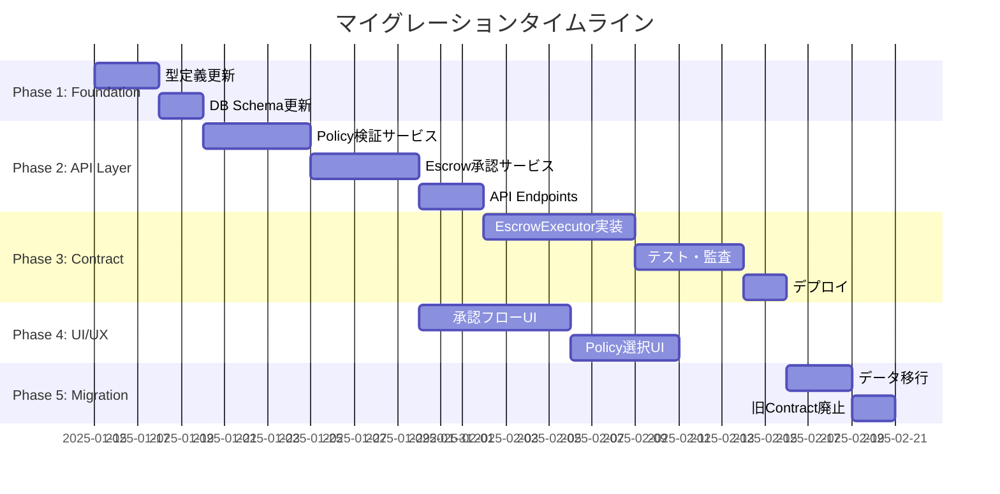

# Policy/Escrow アーキテクチャ マイグレーション計画

## 概要

現在の「両方On-chain」アーキテクチャから「Policy=Off-chain Oracle, Escrow=On-chain Executor」アーキテクチャへの段階的移行計画。

## 移行戦略

**原則**: ゼロダウンタイムで段階的に移行



## Phase 1: Foundation（基盤整備）

### 1.1 型定義の更新

#### Before（現在）
```typescript
// packages/shared/src/types/policy.ts
export interface Policy {
  id: string;
  policyId: string;  // On-chain ID（混乱の元）
  vaultId: string;
  type: PolicyType;
  // ...
}
```

#### After（新アーキテクチャ）
```typescript
// packages/shared/src/types/policy.ts
export interface PaymentPolicy {
  // Off-chain識別子
  id: string;                    // UUID（Primary Key）
  vaultId: string;

  // メタデータ
  name: string;
  description?: string;
  type: 'payment';               // 明示的な型

  // 検証ルール（Oracle的役割）
  threshold: number;             // 必要な承認数
  timelock: number;              // タイムロック（秒）
  maxAmount: string;             // 最大金額（wei文字列）
  rolesRoot: string;             // Merkle Root（承認者ロール）
  ownersRoot: string;            // Merkle Root（オーナー）

  // 状態管理
  active: boolean;
  createdAt: string;
  updatedAt: string;
}

// On-chain参照が必要な場合の拡張型
export interface PaymentPolicyWithOnChain extends PaymentPolicy {
  onChainPolicyId?: string;      // 将来的にon-chain登録する場合用
  registeredOnChain: boolean;
  txHash?: string;
}
```

#### Escrow型の更新

```typescript
// packages/shared/src/types/escrow.ts
export interface Escrow {
  // 識別子
  id: string;                    // UUID（Primary Key）
  vaultId: string;
  policyId: string;              // PaymentPolicy.id を参照

  // メタデータ
  type: 'payment';
  name: string;
  description?: string;

  // Payment詳細
  recipient: string;
  token: string;
  totalAmount: string;
  target?: string;
  data?: string;
  reason?: string;

  // Off-chain進捗管理
  status: EscrowStatus;
  approvals: Approval[];
  deadline?: string;

  // On-chain参照（実行後にセット）
  onChainEscrowId?: number;      // EscrowExecutor.sol内のID
  txHash?: string;               // 登録トランザクション
  executionTxHash?: string;      // 実行トランザクション

  createdAt: string;
  updatedAt: string;
}

export type EscrowStatus =
  | 'draft'       // 下書き（ローカル編集）
  | 'submitted'   // 承認待ち
  | 'approved'    // 承認完了（Policy条件満たした）
  | 'on-chain'    // On-chain登録済み
  | 'executed'    // 実行完了
  | 'cancelled'
  | 'expired';

export interface Approval {
  guardianId: string;
  guardianAddress: string;
  approvedAt: string;
  signature?: string;            // 将来的な署名検証用
  merkleProof?: string[];        // Merkle proof
}
```

**実装手順**:
1. `packages/shared/src/types/policy.ts` を更新
2. `packages/shared/src/types/escrow.ts` を更新
3. 既存コードの型エラーを修正（段階的に対応）

### 1.2 Database Schema更新

```sql
-- Migration: 001_policy_escrow_redesign.sql

-- Payment Policies（Off-chain検証ルール）
CREATE TABLE IF NOT EXISTS payment_policies (
  id UUID PRIMARY KEY DEFAULT gen_random_uuid(),
  vault_id UUID NOT NULL REFERENCES vaults(id),

  -- メタデータ
  name TEXT NOT NULL,
  description TEXT,
  type TEXT NOT NULL DEFAULT 'payment',

  -- 検証ルール
  threshold INTEGER NOT NULL CHECK (threshold > 0),
  timelock INTEGER NOT NULL DEFAULT 0,
  max_amount TEXT NOT NULL,  -- wei文字列
  roles_root TEXT NOT NULL,  -- Merkle Root
  owners_root TEXT NOT NULL, -- Merkle Root

  -- 状態
  active BOOLEAN NOT NULL DEFAULT true,
  created_at TIMESTAMPTZ NOT NULL DEFAULT NOW(),
  updated_at TIMESTAMPTZ NOT NULL DEFAULT NOW(),

  CONSTRAINT valid_type CHECK (type = 'payment')
);

-- Escrows（進捗管理）
CREATE TABLE IF NOT EXISTS escrows (
  id UUID PRIMARY KEY DEFAULT gen_random_uuid(),
  vault_id UUID NOT NULL REFERENCES vaults(id),
  policy_id UUID NOT NULL REFERENCES payment_policies(id),

  -- メタデータ
  type TEXT NOT NULL DEFAULT 'payment',
  name TEXT NOT NULL,
  description TEXT,

  -- Payment詳細
  recipient TEXT NOT NULL,
  token TEXT NOT NULL,
  total_amount TEXT NOT NULL,  -- wei文字列
  target TEXT,
  data TEXT,
  reason TEXT,

  -- 進捗管理
  status TEXT NOT NULL DEFAULT 'draft',
  deadline TIMESTAMPTZ,

  -- On-chain参照
  on_chain_escrow_id INTEGER,
  tx_hash TEXT,
  execution_tx_hash TEXT,

  created_at TIMESTAMPTZ NOT NULL DEFAULT NOW(),
  updated_at TIMESTAMPTZ NOT NULL DEFAULT NOW(),

  CONSTRAINT valid_status CHECK (
    status IN ('draft', 'submitted', 'approved', 'on-chain', 'executed', 'cancelled', 'expired')
  )
);

-- Approvals（承認記録）
CREATE TABLE IF NOT EXISTS escrow_approvals (
  id UUID PRIMARY KEY DEFAULT gen_random_uuid(),
  escrow_id UUID NOT NULL REFERENCES escrows(id) ON DELETE CASCADE,
  guardian_id UUID NOT NULL REFERENCES guardians(id),

  approved_at TIMESTAMPTZ NOT NULL DEFAULT NOW(),
  signature TEXT,
  merkle_proof JSONB,  -- Merkle proof配列

  UNIQUE(escrow_id, guardian_id)
);

-- Indexes
CREATE INDEX idx_payment_policies_vault ON payment_policies(vault_id);
CREATE INDEX idx_payment_policies_active ON payment_policies(active);
CREATE INDEX idx_escrows_vault ON escrows(vault_id);
CREATE INDEX idx_escrows_policy ON escrows(policy_id);
CREATE INDEX idx_escrows_status ON escrows(status);
CREATE INDEX idx_escrow_approvals_escrow ON escrow_approvals(escrow_id);

-- Triggers for updated_at
CREATE OR REPLACE FUNCTION update_updated_at_column()
RETURNS TRIGGER AS $$
BEGIN
  NEW.updated_at = NOW();
  RETURN NEW;
END;
$$ LANGUAGE plpgsql;

CREATE TRIGGER update_payment_policies_updated_at
  BEFORE UPDATE ON payment_policies
  FOR EACH ROW EXECUTE FUNCTION update_updated_at_column();

CREATE TRIGGER update_escrows_updated_at
  BEFORE UPDATE ON escrows
  FOR EACH ROW EXECUTE FUNCTION update_updated_at_column();
```

**実装手順**:
1. Supabaseマイグレーションファイル作成
2. Development環境で実行・テスト
3. Production環境へデプロイ

## Phase 2: API Layer（ビジネスロジック層）

### 2.1 Policy検証サービス

```typescript
// apps/api/src/services/policy-validator.service.ts

import { PaymentPolicy } from '@packages/shared/types/policy';
import { Escrow } from '@packages/shared/types/escrow';
import { MerkleTree } from 'merkletreejs';
import { keccak256 } from 'ethers';

export interface ValidationResult {
  valid: boolean;
  errors: string[];
  warnings: string[];
}

export class PolicyValidatorService {
  /**
   * Escrowが指定されたPolicyの条件を満たすかを検証
   */
  async validateEscrowAgainstPolicy(
    escrow: Escrow,
    policy: PaymentPolicy
  ): Promise<ValidationResult> {
    const errors: string[] = [];
    const warnings: string[] = [];

    // 1. ポリシーが有効か
    if (!policy.active) {
      errors.push('Policy is not active');
      return { valid: false, errors, warnings };
    }

    // 2. 金額チェック
    const amount = BigInt(escrow.totalAmount);
    const maxAmount = BigInt(policy.maxAmount);

    if (amount > maxAmount) {
      errors.push(
        `Amount ${amount} exceeds policy maximum ${maxAmount}`
      );
    }

    if (amount > maxAmount * 90n / 100n) {
      warnings.push('Amount is close to policy maximum');
    }

    // 3. 承認数チェック
    if (escrow.approvals.length < policy.threshold) {
      errors.push(
        `Insufficient approvals: ${escrow.approvals.length}/${policy.threshold}`
      );
    }

    // 4. 各承認者の権限検証（Merkle proof）
    for (const approval of escrow.approvals) {
      const isValid = await this.verifyGuardianRole(
        approval.guardianAddress,
        policy.rolesRoot,
        approval.merkleProof
      );

      if (!isValid) {
        errors.push(
          `Guardian ${approval.guardianAddress} not authorized by policy`
        );
      }
    }

    // 5. Deadline チェック
    if (escrow.deadline) {
      const deadline = new Date(escrow.deadline);
      const now = new Date();

      if (deadline < now) {
        errors.push('Escrow deadline has passed');
      }

      const minTimelock = policy.timelock * 1000; // seconds to ms
      const timeDiff = deadline.getTime() - now.getTime();

      if (timeDiff < minTimelock) {
        errors.push(
          `Deadline too soon. Minimum timelock: ${policy.timelock}s`
        );
      }
    }

    return {
      valid: errors.length === 0,
      errors,
      warnings
    };
  }

  /**
   * Merkle proofを使ってGuardianのロールを検証
   */
  private async verifyGuardianRole(
    guardianAddress: string,
    rolesRoot: string,
    merkleProof?: string[]
  ): Promise<boolean> {
    if (!merkleProof || merkleProof.length === 0) {
      // Proofがない場合、DBから直接確認（後方互換）
      return this.checkGuardianInDB(guardianAddress);
    }

    // Merkle proofの検証
    const leaf = keccak256(guardianAddress);
    return MerkleTree.verify(merkleProof, leaf, rolesRoot);
  }

  /**
   * DB直接確認（Merkle proof未実装時の後方互換）
   */
  private async checkGuardianInDB(
    guardianAddress: string
  ): Promise<boolean> {
    // TODO: Guardianテーブルから確認
    return true;
  }

  /**
   * Policy作成時のMerkle Root生成
   */
  async generateRolesRoot(guardianAddresses: string[]): Promise<string> {
    const leaves = guardianAddresses.map(addr => keccak256(addr));
    const tree = new MerkleTree(leaves, keccak256, { sortPairs: true });
    return tree.getRoot().toString('hex');
  }

  /**
   * Guardian用のMerkle proof生成
   */
  async generateMerkleProof(
    guardianAddress: string,
    allGuardianAddresses: string[]
  ): Promise<string[]> {
    const leaves = allGuardianAddresses.map(addr => keccak256(addr));
    const tree = new MerkleTree(leaves, keccak256, { sortPairs: true });
    const leaf = keccak256(guardianAddress);
    const proof = tree.getProof(leaf);
    return proof.map(p => p.data.toString('hex'));
  }
}
```

### 2.2 Escrow承認サービス

```typescript
// apps/api/src/services/escrow-approval.service.ts

import { Escrow, EscrowStatus, Approval } from '@packages/shared/types/escrow';
import { PaymentPolicy } from '@packages/shared/types/policy';
import { PolicyValidatorService } from './policy-validator.service';
import { supabase } from '../lib/supabase';

export class EscrowApprovalService {
  private validator: PolicyValidatorService;

  constructor() {
    this.validator = new PolicyValidatorService();
  }

  /**
   * Escrowに承認を追加
   */
  async addApproval(
    escrowId: string,
    guardianId: string,
    guardianAddress: string,
    signature?: string
  ): Promise<Escrow> {
    // 1. Escrow取得
    const { data: escrow, error: escrowError } = await supabase
      .from('escrows')
      .select('*')
      .eq('id', escrowId)
      .single();

    if (escrowError || !escrow) {
      throw new Error('Escrow not found');
    }

    // 2. Status確認
    if (escrow.status !== 'submitted') {
      throw new Error(`Cannot approve escrow in status: ${escrow.status}`);
    }

    // 3. 重複承認チェック
    const { data: existingApproval } = await supabase
      .from('escrow_approvals')
      .select('*')
      .eq('escrow_id', escrowId)
      .eq('guardian_id', guardianId)
      .single();

    if (existingApproval) {
      throw new Error('Guardian has already approved');
    }

    // 4. Merkle proof生成（PolicyからGuardian一覧取得が必要）
    const merkleProof = await this.getMerkleProofForGuardian(
      escrow.policy_id,
      guardianAddress
    );

    // 5. 承認を記録
    const { error: approvalError } = await supabase
      .from('escrow_approvals')
      .insert({
        escrow_id: escrowId,
        guardian_id: guardianId,
        signature,
        merkle_proof: merkleProof
      });

    if (approvalError) {
      throw new Error('Failed to record approval');
    }

    // 6. 承認数確認 → Policy条件を満たしたか？
    const updatedEscrow = await this.checkAndUpdateStatus(escrowId);

    return updatedEscrow;
  }

  /**
   * 承認数を確認し、Policy条件を満たしたら状態を更新
   */
  private async checkAndUpdateStatus(escrowId: string): Promise<Escrow> {
    // 1. Escrowと関連データ取得
    const { data: escrow } = await supabase
      .from('escrows')
      .select(`
        *,
        policy:payment_policies(*),
        approvals:escrow_approvals(*)
      `)
      .eq('id', escrowId)
      .single();

    if (!escrow) {
      throw new Error('Escrow not found');
    }

    // 2. Policy検証
    const validation = await this.validator.validateEscrowAgainstPolicy(
      this.mapToEscrowType(escrow),
      escrow.policy as PaymentPolicy
    );

    // 3. 検証成功 → approved状態へ
    if (validation.valid) {
      await supabase
        .from('escrows')
        .update({ status: 'approved' })
        .eq('id', escrowId);

      // 4. On-chain登録をトリガー（別サービス）
      await this.triggerOnChainRegistration(escrowId);
    }

    // 更新されたEscrowを返す
    const { data: updated } = await supabase
      .from('escrows')
      .select('*')
      .eq('id', escrowId)
      .single();

    return this.mapToEscrowType(updated);
  }

  /**
   * On-chain登録をトリガー
   */
  private async triggerOnChainRegistration(escrowId: string): Promise<void> {
    // Queue jobまたは即座に実行
    // 実装はPhase 3で
  }

  /**
   * GuardianのMerkle proof取得
   */
  private async getMerkleProofForGuardian(
    policyId: string,
    guardianAddress: string
  ): Promise<string[] | null> {
    // TODO: Policy関連のGuardian一覧から生成
    return null;
  }

  /**
   * DB行をEscrow型にマップ
   */
  private mapToEscrowType(row: any): Escrow {
    return {
      id: row.id,
      vaultId: row.vault_id,
      policyId: row.policy_id,
      type: 'payment',
      name: row.name,
      description: row.description,
      recipient: row.recipient,
      token: row.token,
      totalAmount: row.total_amount,
      target: row.target,
      data: row.data,
      reason: row.reason,
      status: row.status as EscrowStatus,
      approvals: row.approvals || [],
      deadline: row.deadline,
      onChainEscrowId: row.on_chain_escrow_id,
      txHash: row.tx_hash,
      executionTxHash: row.execution_tx_hash,
      createdAt: row.created_at,
      updatedAt: row.updated_at
    };
  }
}
```

### 2.3 API Endpoints

```typescript
// apps/api/src/routes/escrow.routes.ts

import express from 'express';
import { EscrowApprovalService } from '../services/escrow-approval.service';
import { PolicyValidatorService } from '../services/policy-validator.service';

const router = express.Router();
const approvalService = new EscrowApprovalService();
const validatorService = new PolicyValidatorService();

/**
 * POST /api/escrows/:id/approve
 * Escrowに承認を追加
 */
router.post('/:id/approve', async (req, res) => {
  try {
    const { id } = req.params;
    const { guardianId, guardianAddress, signature } = req.body;

    const updatedEscrow = await approvalService.addApproval(
      id,
      guardianId,
      guardianAddress,
      signature
    );

    res.json({ escrow: updatedEscrow });
  } catch (error) {
    res.status(400).json({ error: error.message });
  }
});

/**
 * POST /api/escrows/:id/validate
 * Escrowを検証（実際には承認せず、結果のみ返す）
 */
router.post('/:id/validate', async (req, res) => {
  try {
    const { id } = req.params;

    // Escrow取得
    const { data: escrow } = await supabase
      .from('escrows')
      .select(`
        *,
        policy:payment_policies(*)
      `)
      .eq('id', id)
      .single();

    if (!escrow) {
      return res.status(404).json({ error: 'Escrow not found' });
    }

    // 検証
    const validation = await validatorService.validateEscrowAgainstPolicy(
      escrow,
      escrow.policy
    );

    res.json({ validation });
  } catch (error) {
    res.status(400).json({ error: error.message });
  }
});

export default router;
```

**実装手順**:
1. `PolicyValidatorService` 実装
2. `EscrowApprovalService` 実装
3. API Endpoints追加
4. ユニットテスト作成
5. 統合テスト作成

## Phase 3: Smart Contract（On-chain実行層）

### 3.1 EscrowExecutor実装

```solidity
// contracts/core/EscrowExecutor.sol
// SPDX-License-Identifier: MIT
pragma solidity ^0.8.24;

import "@openzeppelin/contracts-upgradeable/proxy/utils/Initializable.sol";
import "@openzeppelin/contracts-upgradeable/access/AccessControlUpgradeable.sol";
import "@openzeppelin/contracts-upgradeable/proxy/utils/UUPSUpgradeable.sol";
import "@openzeppelin/contracts/token/ERC20/IERC20.sol";
import "../interfaces/IVault.sol";

/**
 * @title EscrowExecutor
 * @notice 承認済みEscrowの実行のみを担当
 * @dev Policy検証は既にOff-chain（APIサーバー）で完了している前提
 */
contract EscrowExecutor is
    Initializable,
    AccessControlUpgradeable,
    UUPSUpgradeable
{
    /// @notice 実行可能なEscrow情報
    struct OnChainEscrow {
        uint256 id;
        address vaultAddress;
        address recipient;
        address token;
        uint256 amount;
        uint256 executeAfter;      // Timelock解除時刻
        bool executed;
        uint256 registeredAt;
    }

    /// @notice Roles
    bytes32 public constant ADMIN_ROLE = keccak256("ADMIN_ROLE");
    bytes32 public constant EXECUTOR_ROLE = keccak256("EXECUTOR_ROLE");

    /// @notice State
    uint256 private _escrowCounter;
    mapping(uint256 => OnChainEscrow) private _escrows;
    mapping(address => uint256[]) private _vaultEscrows;

    /// @notice Events
    event EscrowRegistered(
        uint256 indexed escrowId,
        address indexed vaultAddress,
        address indexed recipient,
        address token,
        uint256 amount,
        uint256 executeAfter
    );

    event EscrowExecuted(
        uint256 indexed escrowId,
        address indexed recipient,
        address token,
        uint256 amount
    );

    event EscrowCancelled(
        uint256 indexed escrowId,
        address indexed cancelledBy
    );

    /// @custom:oz-upgrades-unsafe-allow constructor
    constructor() {
        _disableInitializers();
    }

    /**
     * @notice Initialize contract
     */
    function initialize(address admin) public initializer {
        __AccessControl_init();
        __UUPSUpgradeable_init();

        _grantRole(DEFAULT_ADMIN_ROLE, admin);
        _grantRole(ADMIN_ROLE, admin);
        _grantRole(EXECUTOR_ROLE, admin);

        _escrowCounter = 1;
    }

    /**
     * @notice 承認済みEscrowを登録
     * @dev この時点でPolicy検証は完了済み（APIサーバーで実行済み）
     * @param vaultAddress 対象Vault
     * @param recipient 受取人
     * @param token トークンアドレス
     * @param amount 金額
     * @param timelockSeconds Timelock秒数
     */
    function registerEscrow(
        address vaultAddress,
        address recipient,
        address token,
        uint256 amount,
        uint256 timelockSeconds
    ) external onlyRole(EXECUTOR_ROLE) returns (uint256 escrowId) {
        require(vaultAddress != address(0), "Invalid vault");
        require(recipient != address(0), "Invalid recipient");
        require(amount > 0, "Amount must be > 0");

        escrowId = _escrowCounter++;

        _escrows[escrowId] = OnChainEscrow({
            id: escrowId,
            vaultAddress: vaultAddress,
            recipient: recipient,
            token: token,
            amount: amount,
            executeAfter: block.timestamp + timelockSeconds,
            executed: false,
            registeredAt: block.timestamp
        });

        _vaultEscrows[vaultAddress].push(escrowId);

        emit EscrowRegistered(
            escrowId,
            vaultAddress,
            recipient,
            token,
            amount,
            block.timestamp + timelockSeconds
        );

        return escrowId;
    }

    /**
     * @notice Escrowを実行（Timelock後）
     * @param escrowId Escrow ID
     */
    function executeEscrow(uint256 escrowId) external {
        OnChainEscrow storage escrow = _escrows[escrowId];

        require(escrow.id != 0, "Escrow does not exist");
        require(!escrow.executed, "Already executed");
        require(
            block.timestamp >= escrow.executeAfter,
            "Timelock still active"
        );

        escrow.executed = true;

        // Vaultから資金を転送
        if (escrow.token == address(0)) {
            // ETH transfer
            IVault(escrow.vaultAddress).transferETH(
                escrow.recipient,
                escrow.amount
            );
        } else {
            // ERC20 transfer
            IVault(escrow.vaultAddress).transferERC20(
                escrow.token,
                escrow.recipient,
                escrow.amount
            );
        }

        emit EscrowExecuted(
            escrowId,
            escrow.recipient,
            escrow.token,
            escrow.amount
        );
    }

    /**
     * @notice Escrowをキャンセル（実行前のみ）
     * @param escrowId Escrow ID
     */
    function cancelEscrow(uint256 escrowId)
        external
        onlyRole(ADMIN_ROLE)
    {
        OnChainEscrow storage escrow = _escrows[escrowId];

        require(escrow.id != 0, "Escrow does not exist");
        require(!escrow.executed, "Already executed");

        escrow.executed = true;  // 再実行防止のためtrueにする

        emit EscrowCancelled(escrowId, msg.sender);
    }

    /**
     * @notice Escrow情報取得
     */
    function getEscrow(uint256 escrowId)
        external
        view
        returns (OnChainEscrow memory)
    {
        require(_escrows[escrowId].id != 0, "Escrow does not exist");
        return _escrows[escrowId];
    }

    /**
     * @notice Vault別のEscrow ID一覧取得
     */
    function getVaultEscrows(address vaultAddress)
        external
        view
        returns (uint256[] memory)
    {
        return _vaultEscrows[vaultAddress];
    }

    /**
     * @notice Upgrade authorization
     */
    function _authorizeUpgrade(address newImplementation)
        internal
        override
        onlyRole(ADMIN_ROLE)
    {}
}
```

### 3.2 On-chain登録サービス

```typescript
// apps/api/src/services/on-chain-executor.service.ts

import { ethers } from 'ethers';
import { Escrow } from '@packages/shared/types/escrow';
import { PaymentPolicy } from '@packages/shared/types/policy';
import EscrowExecutorABI from '../abis/EscrowExecutor.json';

export class OnChainExecutorService {
  private provider: ethers.Provider;
  private executorContract: ethers.Contract;
  private signer: ethers.Wallet;

  constructor() {
    this.provider = new ethers.JsonRpcProvider(
      process.env.RPC_URL
    );

    this.signer = new ethers.Wallet(
      process.env.EXECUTOR_PRIVATE_KEY,
      this.provider
    );

    this.executorContract = new ethers.Contract(
      process.env.ESCROW_EXECUTOR_ADDRESS,
      EscrowExecutorABI,
      this.signer
    );
  }

  /**
   * 承認済みEscrowをOn-chainに登録
   */
  async registerEscrowOnChain(
    escrow: Escrow,
    policy: PaymentPolicy
  ): Promise<{ escrowId: number; txHash: string }> {
    try {
      const tx = await this.executorContract.registerEscrow(
        escrow.vaultId,           // Vault address
        escrow.recipient,
        escrow.token,
        escrow.totalAmount,
        policy.timelock
      );

      const receipt = await tx.wait();

      // EscrowRegistered イベントからIDを取得
      const event = receipt.logs.find(
        (log: any) => log.eventName === 'EscrowRegistered'
      );

      const escrowId = event?.args?.escrowId;

      // DBを更新
      await supabase
        .from('escrows')
        .update({
          status: 'on-chain',
          on_chain_escrow_id: escrowId.toString(),
          tx_hash: receipt.hash
        })
        .eq('id', escrow.id);

      return {
        escrowId: Number(escrowId),
        txHash: receipt.hash
      };
    } catch (error) {
      console.error('Failed to register escrow on-chain:', error);
      throw error;
    }
  }

  /**
   * On-chain Escrowを実行（Timelock後）
   */
  async executeEscrowOnChain(
    onChainEscrowId: number
  ): Promise<string> {
    try {
      const tx = await this.executorContract.executeEscrow(
        onChainEscrowId
      );

      const receipt = await tx.wait();

      // DBを更新
      await supabase
        .from('escrows')
        .update({
          status: 'executed',
          execution_tx_hash: receipt.hash
        })
        .eq('on_chain_escrow_id', onChainEscrowId);

      return receipt.hash;
    } catch (error) {
      console.error('Failed to execute escrow on-chain:', error);
      throw error;
    }
  }
}
```

**実装手順**:
1. `EscrowExecutor.sol` 実装
2. Hardhat テスト作成
3. セキュリティ監査
4. Testnetデプロイ
5. `OnChainExecutorService` 実装
6. 統合テスト

## Phase 4: UI/UX更新

### 4.1 承認フローUI

```typescript
// apps/web/src/components/wallet/EscrowApproval.tsx

export function EscrowApprovalCard({ escrow }: { escrow: Escrow }) {
  const [policy, setPolicy] = useState<PaymentPolicy | null>(null);
  const [validation, setValidation] = useState<ValidationResult | null>(null);

  useEffect(() => {
    // Policy取得
    fetch(`/api/policies/${escrow.policyId}`)
      .then(res => res.json())
      .then(data => setPolicy(data.policy));

    // リアルタイム検証
    fetch(`/api/escrows/${escrow.id}/validate`)
      .then(res => res.json())
      .then(data => setValidation(data.validation));
  }, [escrow]);

  const handleApprove = async () => {
    await fetch(`/api/escrows/${escrow.id}/approve`, {
      method: 'POST',
      body: JSON.stringify({
        guardianId: currentUser.id,
        guardianAddress: currentUser.address
      })
    });
  };

  return (
    <Card>
      <CardHeader>
        <CardTitle>{escrow.name}</CardTitle>
      </CardHeader>
      <CardContent>
        {/* Policy情報表示 */}
        <div className="space-y-2">
          <div>Policy: {policy?.name}</div>
          <div>
            Approvals: {escrow.approvals.length} / {policy?.threshold}
          </div>
          <div>Amount: {escrow.totalAmount}</div>
          <div>Max Allowed: {policy?.maxAmount}</div>
        </div>

        {/* 検証結果 */}
        {validation && (
          <div className="mt-4">
            {validation.errors.map(err => (
              <Alert variant="destructive" key={err}>
                {err}
              </Alert>
            ))}
            {validation.warnings.map(warn => (
              <Alert variant="warning" key={warn}>
                {warn}
              </Alert>
            ))}
          </div>
        )}

        {/* 承認ボタン */}
        <Button
          onClick={handleApprove}
          disabled={!!validation?.errors.length}
        >
          Approve
        </Button>
      </CardContent>
    </Card>
  );
}
```

**実装手順**:
1. リアルタイム検証UI
2. 承認進捗表示
3. Policy条件の可視化
4. エラーハンドリングUI

## Phase 5: データ移行と旧Contract廃止

### 5.1 データ移行スクリプト

```typescript
// scripts/migrate-escrows.ts

async function migrateEscrowsToNewArchitecture() {
  // 1. 既存のEscrowRegistry.solからデータ取得
  // 2. 新しいDB Schemaへマイグレーション
  // 3. PolicyManager.solからPolicy取得 → DB移行
  // 4. 検証
}
```

### 5.2 旧Contract段階的廃止

1. 新Contractへの切り替え
2. 旧Contract読み取り専用化
3. 完全廃止

## まとめ

この段階的マイグレーションにより:
- ✅ ゼロダウンタイム
- ✅ データ損失なし
- ✅ 段階的な検証
- ✅ ロールバック可能

次は型定義の更新から始めます。
