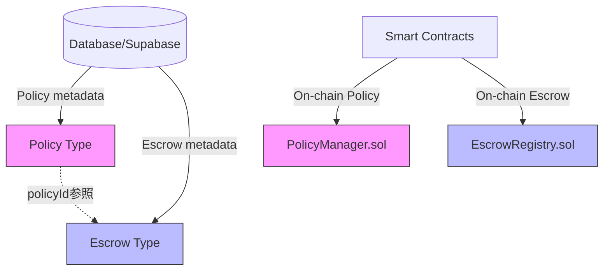
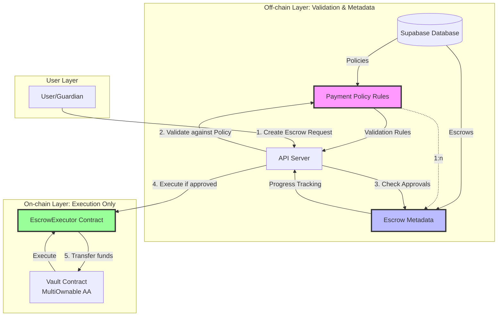
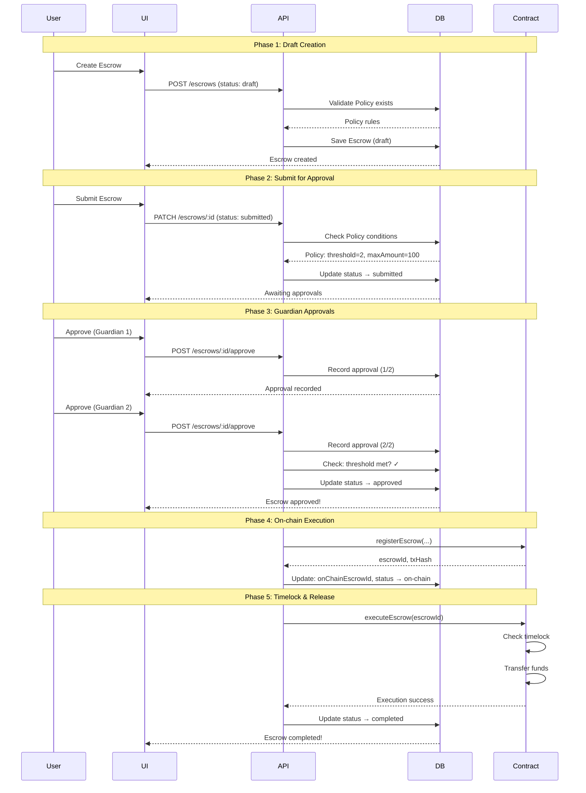

# Payment Policy と Escrow の関係性再設計

## 概要

このドキュメントでは、Family Wallet における Payment Policy と Escrow の関係性を再定義し、より明確で効率的なアーキテクチャを提案します。

## 現状の問題点

### 1. 重複した状態管理



**問題**:
- PolicyManager.sol と Policy型定義の両方が存在し、どちらが真実の情報源か不明確
- EscrowRegistry.sol には Policy への参照が**ない**（TypeScript型にはあるが、スマートコントラクトにはない）
- 状態の同期が困難
- 不要なガスコストの発生

### 2. 不明確な責任分離

現在の実装では:
- **PolicyManager**: ポリシールールをon-chainで管理
- **EscrowRegistry**: エスクロー状態をon-chainで管理
- **TypeScript型**: 両方のメタデータをoff-chainで管理

しかし、これらの関係性が不明確。

## 新しいアーキテクチャ: Policy as Oracle Pattern

### コンセプト

> **Payment Policy = 外部検証ルール（Oracle的役割）**
> **Escrow = On-chain実行 + Off-chain進捗管理**

### アーキテクチャ図



### データモデル

#### Off-chain: Payment Policy（検証ルール）

```typescript
interface PaymentPolicy {
  id: string;                    // UUID (primary key)
  vaultId: string;               // 対象Vault
  name: string;
  description?: string;

  // 検証ルール（Oracle的役割）
  threshold: number;             // 必要な承認数
  timelock: number;              // タイムロック（秒）
  maxAmount: string;             // 最大金額（wei）
  rolesRoot: string;             // Merkle Root（承認者ロール）
  ownersRoot: string;            // Merkle Root（オーナー）

  active: boolean;
  createdAt: string;
  updatedAt: string;
}
```

**役割**:
- Escrow作成時の検証条件
- 承認フローの制御ルール
- APIサーバーが参照する「外部オラクル情報」

#### Off-chain: Escrow（進捗管理）

```typescript
interface Escrow {
  id: string;                    // UUID (primary key)
  vaultId: string;               // 対象Vault
  policyId: string;              // 参照するPolicy（検証ルール）

  // メタデータ
  name: string;
  description?: string;
  token: string;
  totalAmount: string;

  // Payment情報
  recipient: string;
  target?: string;
  data?: string;
  reason?: string;

  // 進捗状態（Off-chain tracking）
  status: EscrowStatus;          // draft → submitted → approved → on-chain → completed
  approvals: Approval[];         // 承認状況

  // On-chain参照
  onChainEscrowId?: string;      // 実行後のon-chain ID
  txHash?: string;               // トランザクションハッシュ

  deadline?: string;
  createdAt: string;
  updatedAt: string;
}

type EscrowStatus =
  | 'draft'       // 下書き（ローカル編集中）
  | 'submitted'   // 承認待ち（APIに送信済み）
  | 'approved'    // 承認完了（Policy条件を満たした）
  | 'on-chain'    // On-chain実行済み
  | 'completed'   // 完了
  | 'cancelled'   // キャンセル
  | 'expired';    // 期限切れ

interface Approval {
  guardianId: string;
  approvedAt: string;
  signature?: string;
}
```

**役割**:
- ユーザーリクエストの進捗管理
- 承認状態の追跡
- Policy条件を満たしたらon-chain実行をトリガー

#### On-chain: EscrowExecutor（実行のみ）

```solidity
/**
 * @title EscrowExecutor
 * @notice 承認済みEscrowの実行のみを担当
 * @dev Policyチェックは既にOff-chainで完了している前提
 */
contract EscrowExecutor {
    struct OnChainEscrow {
        uint256 id;
        address vaultAddress;
        address recipient;
        address token;
        uint256 amount;
        uint256 executeAfter;      // Timelock解除時刻
        bool executed;
    }

    mapping(uint256 => OnChainEscrow) public escrows;
    uint256 public escrowCounter;

    /**
     * @notice 承認済みEscrowを登録（APIサーバーから呼ばれる）
     * @dev この時点でPolicy検証は完了済み
     */
    function registerEscrow(
        address vaultAddress,
        address recipient,
        address token,
        uint256 amount,
        uint256 timelockSeconds
    ) external onlyAuthorized returns (uint256 escrowId) {
        escrowId = ++escrowCounter;

        escrows[escrowId] = OnChainEscrow({
            id: escrowId,
            vaultAddress: vaultAddress,
            recipient: recipient,
            token: token,
            amount: amount,
            executeAfter: block.timestamp + timelockSeconds,
            executed: false
        });

        emit EscrowRegistered(escrowId, vaultAddress, recipient, amount);
        return escrowId;
    }

    /**
     * @notice Escrowを実行（Timelock後）
     */
    function executeEscrow(uint256 escrowId) external {
        OnChainEscrow storage escrow = escrows[escrowId];
        require(!escrow.executed, "Already executed");
        require(block.timestamp >= escrow.executeAfter, "Timelock active");

        escrow.executed = true;

        // Vaultから資金を転送
        IVault(escrow.vaultAddress).transfer(
            escrow.token,
            escrow.recipient,
            escrow.amount
        );

        emit EscrowExecuted(escrowId, escrow.recipient, escrow.amount);
    }
}
```

**役割**:
- 承認済みEscrowのon-chain登録
- Timelock管理
- 実際の資金移動実行
- **Policy検証は行わない**（既にOff-chainで完了済み）

## フロー図

### 1. Escrow作成から実行までのフロー



### 2. Policy検証のロジック

```typescript
// apps/api/src/services/escrow.service.ts

async function validateEscrowAgainstPolicy(
  escrow: Escrow,
  policy: PaymentPolicy
): Promise<{ valid: boolean; errors: string[] }> {
  const errors: string[] = [];

  // 1. 金額チェック
  if (BigInt(escrow.totalAmount) > BigInt(policy.maxAmount)) {
    errors.push(`Amount ${escrow.totalAmount} exceeds policy max ${policy.maxAmount}`);
  }

  // 2. 承認数チェック
  if (escrow.approvals.length < policy.threshold) {
    errors.push(`Insufficient approvals: ${escrow.approvals.length}/${policy.threshold}`);
  }

  // 3. 承認者の権限チェック（Merkle proof検証）
  for (const approval of escrow.approvals) {
    const isValid = await verifyGuardianRole(
      approval.guardianId,
      policy.rolesRoot
    );
    if (!isValid) {
      errors.push(`Guardian ${approval.guardianId} not authorized`);
    }
  }

  return {
    valid: errors.length === 0,
    errors
  };
}

async function approveEscrow(escrowId: string): Promise<void> {
  const escrow = await getEscrow(escrowId);
  const policy = await getPolicy(escrow.policyId);

  // Policy検証
  const validation = await validateEscrowAgainstPolicy(escrow, policy);

  if (!validation.valid) {
    throw new Error(`Policy validation failed: ${validation.errors.join(', ')}`);
  }

  // 承認完了 → On-chain登録
  if (escrow.approvals.length >= policy.threshold) {
    const txHash = await executeOnChain(escrow, policy);
    await updateEscrow(escrowId, {
      status: 'on-chain',
      onChainEscrowId: txHash,
      txHash
    });
  }
}
```

## マイグレーション計画

### Phase 1: データモデル更新

1. **Policy型の明確化**
   - `packages/shared/src/types/policy.ts` を更新
   - Off-chain validation rulesとしての役割を明確化
   - `policyId`（UUID）とon-chain IDの分離

2. **Escrow型の更新**
   - `status`フィールドの詳細化
   - `approvals`配列の追加
   - `onChainEscrowId`と`txHash`の明確化

### Phase 2: API層の実装

1. **Policy検証ロジック**
   - `apps/api/src/services/policy-validator.service.ts` 作成
   - Merkle proof検証ロジック実装
   - 金額・承認数・期限チェック

2. **Escrow承認フロー**
   - `apps/api/src/services/escrow-approval.service.ts` 作成
   - 段階的な状態遷移管理
   - Policy条件チェック

### Phase 3: Smart Contract簡素化

1. **EscrowExecutor作成**
   - `contracts/core/EscrowExecutor.sol` 作成
   - 最小限の実行ロジックのみ
   - Policy検証は削除（APIサーバーに移譲）

2. **既存Contract段階的廃止**
   - `EscrowRegistry.sol` → `EscrowExecutor.sol`
   - `PolicyManager.sol` → Off-chain Policy管理

### Phase 4: UI層の更新

1. **Escrow作成フロー改善**
   - Policy選択UIの明確化
   - リアルタイムPolicy検証フィードバック
   - 承認進捗の可視化

2. **承認フロー実装**
   - Guardian承認UI
   - 承認状況ダッシュボード
   - Policy条件の表示

## 利点

### 1. ガスコスト削減

**Before**: Policy情報をon-chainに保存
```solidity
// PolicyManager.sol - 高コスト
function createPolicy(...) external {
    Policy storage policy = _policies[policyId];
    policy.minApprovals = minApprovals;      // SSTORE
    policy.maxAmount = maxAmount;            // SSTORE
    policy.cooldownPeriod = cooldownPeriod;  // SSTORE
    policy.rolesRoot = rolesRoot;            // SSTORE
    policy.ownersRoot = ownersRoot;          // SSTORE
    // 合計: 5 SSTORE = ~100,000 gas
}
```

**After**: Off-chain Policy管理
```typescript
// API Server - ガスコスト0
async function createPolicy(data: PaymentPolicy) {
  return supabase.from('policies').insert(data);
  // Database insert only, no gas cost
}
```

**節約**: Policy作成あたり約100,000 gas

### 2. 柔軟性の向上

**Before**: Policy変更にスマートコントラクトのアップグレードが必要
```solidity
// Contract upgrade required for new validation logic
function validateEscrow(...) {
    // Hard-coded validation logic
}
```

**After**: API層で柔軟に変更可能
```typescript
// No contract upgrade needed
async function validateEscrowAgainstPolicy(escrow, policy) {
  // Add new validation rules easily
  if (policy.requiresKYC && !escrow.kycVerified) {
    return false;
  }

  if (policy.blacklistedAddresses.includes(escrow.recipient)) {
    return false;
  }

  // Easy to extend
}
```

### 3. UX改善

**Before**: On-chain処理のため即座のフィードバックが困難
```typescript
// User must wait for transaction confirmation
await contract.createEscrow(...);  // Waiting...
```

**After**: 即座のValidationフィードバック
```typescript
// Immediate validation feedback
const validation = await api.validateEscrow(draft);
if (!validation.valid) {
  showErrors(validation.errors);  // Instant feedback
}
```

### 4. セキュリティ向上

**責任の明確化**:
- **Smart Contract**: 資金移動のみ（最小限の攻撃面）
- **API Server**: 複雑なValidation（定期的な更新可能）
- **Database**: メタデータ管理（監査ログ完備）

## 実装優先順位

### 優先度: High
- [ ] Policy型定義の更新
- [ ] Escrow型定義の更新
- [ ] Policy検証APIエンドポイント
- [ ] Escrow承認フローAPI

### 優先度: Medium
- [ ] EscrowExecutor.sol実装
- [ ] Merkle proof検証ロジック
- [ ] 承認UI実装

### 優先度: Low
- [ ] 既存Contract廃止
- [ ] マイグレーションスクリプト
- [ ] ドキュメント整備

## まとめ

新しいアーキテクチャでは:

1. **Payment Policy = 外部検証ルール（Oracle的役割）**
   - Off-chainで管理
   - APIサーバーが参照
   - 柔軟に変更可能

2. **Escrow = On-chain実行 + Off-chain進捗管理**
   - Off-chainで承認フロー管理
   - Policy条件を満たしたらon-chain実行
   - ガスコスト最小化

この分離により、ガスコスト削減、柔軟性向上、UX改善を実現します。
