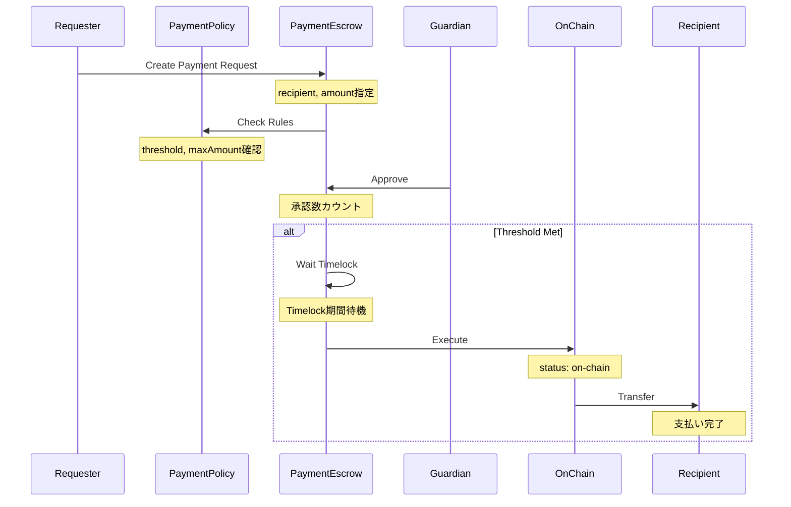

# Policy-Based Architecture Design

## 概要

Family Walletの資金管理を「支払い」と「集金」の2軸で整理し、Policyで資金の流れを制御、Escrowで実行を管理するアーキテクチャ。

## コンセプト

```
Vault (共同ウォレット)
│
├── Policy (ポリシー層) ← 資金の流れのルール定義
│   ├── Payment Policy  (支払いポリシー)
│   │   └── 誰が・いくらまで・どんな条件で支払えるか
│   └── Collection Policy (集金ポリシー)
│       └── 誰が・いくら・いつまでに入金すべきか
│
└── Escrow (実行層) ← 資金移動の実行管理
    ├── Payment Escrow  (支払いエスクロー)
    │   └── Vaultから外部への送金をロック・承認・解放
    └── Collection Escrow (集金エスクロー)
        └── 外部からVaultへの入金を追跡・管理
```

## データモデル

### Policies Table (拡張)

```typescript
{
  id: UUID,
  vaultId: UUID,                    // 所属Vault
  
  // Policy Type & Identity
  type: 'payment' | 'collection',   // ポリシータイプ
  name: string,                      // ポリシー名
  description: string,               // 説明
  
  // Payment Policy Settings
  threshold?: number,                // 必要承認数
  timelock?: number,                 // タイムロック(秒)
  maxAmount?: string,                // 最大金額
  rolesRoot?: string,                // 承認者Merkle Root
  ownersRoot?: string,               // オーナーMerkle Root
  
  // Collection Policy Settings
  collectionConfig?: {
    deadline?: Date,                 // 集金期限
    autoComplete: boolean,           // 全員完了時自動on-chain化
    participantRules: {
      type: 'fixed' | 'percentage' | 'flexible',
      allowPartialPayment: boolean   // 分割払い許可
    }
  },
  
  active: boolean,
  createdAt: Date,
  updatedAt: Date,
  metadata: JSONB
}
```

### Escrows Table (統合)

```typescript
{
  id: UUID,
  vaultId: UUID,                    // 所属Vault
  policyId: UUID,                   // 適用Policy
  
  // Escrow Type & Identity
  type: 'payment' | 'collection',   // エスクロータイプ
  name: string,                      // エスクロー名
  description: string,               // 説明
  
  // Transaction Details
  token: Address,                    // トークンアドレス
  totalAmount: string,               // 総額(wei)
  
  // Payment Escrow Fields (type='payment')
  requester?: Address,               // リクエスト者
  recipient?: Address,               // 受取先
  target?: Address,                  // Call target
  data?: string,                     // Call data
  
  // Collection Escrow Fields (type='collection')
  collectedAmount?: string,          // 集金済み金額
  participants?: [
    {
      address: Address,
      name?: string,
      allocatedAmount: string,       // 割当金額
      paidAmount: string,            // 支払済み金額
      status: 'pending' | 'partial' | 'paid' | 'overdue',
      paidAt?: Date,
      txHash?: string,
      lastPaymentAt?: Date
    }
  ],
  
  // Status & Timeline
  status: 'draft' | 'submitted' | 'approved' | 'on-chain' | 'completed' | 'cancelled',
  
  deadline?: Date,
  scheduledReleaseAt?: Date,
  expiresAt?: Date,
  
  // On-chain Data
  escrowId?: string,                 // bytes32 (on-chain ID)
  txHash?: string,                   // トランザクションハッシュ
  
  createdAt: Date,
  updatedAt: Date,
  metadata: JSONB
}
```

## データフロー

### 1. Collection Flow (集金)

```mermaid
sequenceDiagram
    participant Owner
    participant Vault
    participant CollectionPolicy
    participant CollectionEscrow
    participant Participant
    participant OnChain

    Owner->>CollectionPolicy: Create Collection Policy
    Note over CollectionPolicy: 集金ルール定義<br/>期限、自動完了など
    
    Owner->>CollectionEscrow: Create Collection Escrow
    Note over CollectionEscrow: 参加者リスト作成<br/>各自の割当金額設定
    
    Participant->>Vault: Send Payment
    Note over Vault: Vault宛に送金
    
    Vault-->>CollectionEscrow: Record Payment
    Note over CollectionEscrow: participants配列更新<br/>paidAmount加算
    
    alt All Participants Paid
        CollectionEscrow->>OnChain: Auto Submit
        Note over OnChain: status: on-chain<br/>集金完了
    end
    
    OnChain->>Vault: Funds Available
    Note over Vault: Vaultで資金利用可能
```

### 2. Payment Flow (支払い)



## API設計

### Policies API

```typescript
// Payment Policy作成
POST /api/policies
{
  vaultId: UUID,
  type: 'payment',
  name: string,
  threshold: number,
  timelock: number,
  maxAmount: string,
  rolesRoot: string,
  ownersRoot: string
}

// Collection Policy作成
POST /api/policies
{
  vaultId: UUID,
  type: 'collection',
  name: string,
  collectionConfig: {
    deadline?: Date,
    autoComplete: boolean,
    participantRules: {...}
  }
}

// Policy一覧取得 (type別フィルター)
GET /api/policies?vaultId={id}&type={payment|collection}

// Policy詳細
GET /api/policies/:id
```

### Escrows API

```typescript
// Payment Escrow作成
POST /api/escrows
{
  vaultId: UUID,
  policyId: UUID,
  type: 'payment',
  name: string,
  token: Address,
  totalAmount: string,
  recipient: Address,
  requester: Address
}

// Collection Escrow作成
POST /api/escrows
{
  vaultId: UUID,
  policyId: UUID,
  type: 'collection',
  name: string,
  token: Address,
  totalAmount: string,
  participants: [...]
}

// Escrow一覧取得 (type別フィルター)
GET /api/escrows?vaultId={id}&type={payment|collection}

// Escrow詳細
GET /api/escrows/:id

// Collection専用: 支払記録
POST /api/escrows/:id/payments
{
  participantAddress: Address,
  amount: string,
  txHash: string
}

// Payment専用: 承認
POST /api/escrows/:id/approvals
{
  approver: Address,
  signature: string
}
```

## マイグレーション戦略

### Phase 1: Schema拡張 (Breaking Changeなし)

```sql
-- Policies拡張
ALTER TABLE policies ADD COLUMN type VARCHAR(50);
ALTER TABLE policies ADD COLUMN collection_config JSONB;

-- 既存データにdefault値設定
UPDATE policies SET type = 'payment' WHERE type IS NULL;

-- escrow_drafts → escrows リネーム
ALTER TABLE escrow_drafts RENAME TO escrows;

-- Escrows拡張
ALTER TABLE escrows ADD COLUMN type VARCHAR(50);
ALTER TABLE escrows ADD COLUMN policy_id UUID REFERENCES policies(id);
ALTER TABLE escrows ADD COLUMN collected_amount VARCHAR(78);
ALTER TABLE escrows ADD COLUMN participants JSONB;
ALTER TABLE escrows ADD COLUMN name VARCHAR(255);

-- 既存データにdefault値設定
UPDATE escrows SET type = 'payment' WHERE type IS NULL;
```

### Phase 2: Index追加

```sql
CREATE INDEX policy_type_idx ON policies(type);
CREATE INDEX policy_vault_type_idx ON policies(vault_id, type);
CREATE INDEX escrow_type_idx ON escrows(type);
CREATE INDEX escrow_policy_idx ON escrows(policy_id);
CREATE INDEX escrow_vault_type_idx ON escrows(vault_id, type);
```

### Phase 3: Constraint追加

```sql
-- Policy typeのバリデーション
ALTER TABLE policies ADD CONSTRAINT policy_type_check 
  CHECK (type IN ('payment', 'collection'));

-- Escrow typeのバリデーション
ALTER TABLE escrows ADD CONSTRAINT escrow_type_check 
  CHECK (type IN ('payment', 'collection'));

-- Payment Escrowの必須フィールド
ALTER TABLE escrows ADD CONSTRAINT payment_escrow_fields_check
  CHECK (
    type != 'payment' OR 
    (requester IS NOT NULL AND recipient IS NOT NULL)
  );

-- Collection Escrowの必須フィールド
ALTER TABLE escrows ADD CONSTRAINT collection_escrow_fields_check
  CHECK (
    type != 'collection' OR 
    (participants IS NOT NULL AND collected_amount IS NOT NULL)
  );
```

## 実装の優先順位

### Step 1: Database Migration (最優先)
- [ ] schema.ts更新
- [ ] マイグレーションファイル作成
- [ ] マイグレーション実行・検証

### Step 2: Type Definitions
- [ ] shared/types/policy.ts作成
- [ ] shared/types/escrow.ts更新
- [ ] Collection型をEscrow型に統合

### Step 3: Backend API (段階的)
- [ ] Policies API更新 (type対応)
- [ ] Escrows API更新 (Payment/Collection統合)
- [ ] 後方互換性維持

### Step 4: Frontend Components (段階的)
- [ ] PolicyManagement更新
- [ ] EscrowList更新 (type別表示)
- [ ] CollectionをEscrowの一種として統合

## メリット

1. **概念的統一性**
   - 支払いと集金が対称的
   - PolicyとEscrowの関係明確

2. **拡張性**
   - 新しいPolicy type追加可能
   - 定期支払い、報酬分配なども同様に実装可能

3. **データの一貫性**
   - すべての資金移動がEscrowで追跡
   - Policy適用が明確

4. **既存機能との互換性**
   - 既存Payment機能は `type='payment'`
   - Collectionは `type='collection'`
   - 段階的移行可能

## 注意事項

- マイグレーション実行前に必ずバックアップ
- 既存のescrowDraftsテーブルが未作成の可能性 → 確認必須
- 段階的にリリース、各Phaseで動作確認
