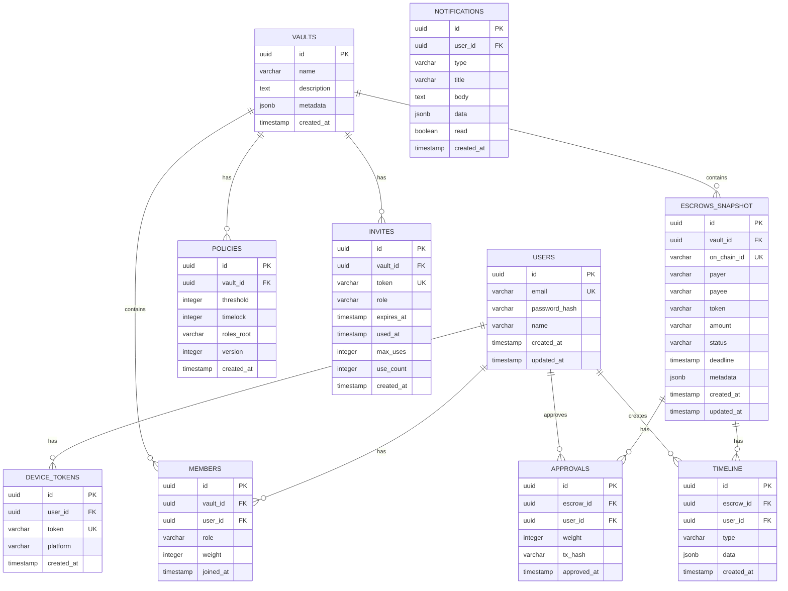

# データベース設計（逆生成）

**DBMS**: Neon PostgreSQL (Serverless)  
**ORM**: Drizzle ORM  
**スキーマファイル**: `apps/api/src/db/schema.ts`

## スキーマ概要

### テーブル一覧

1. **users** - ユーザー情報
2. **vaults** - Vault (グループ) 情報
3. **members** - Vaultメンバーシップ
4. **policies** - Policy設定（オフチェーンキャッシュ）
5. **invites** - 招待リンク
6. **escrows_snapshot** - Escrowスナップショット（Subgraph補完）
7. **approvals** - 承認履歴
8. **timeline** - Escrowタイムライン
9. **notifications** - 通知履歴
10. **device_tokens** - Push通知トークン

### ER図



## テーブル詳細

### users テーブル

**役割**: ユーザーアカウント情報

```sql
CREATE TABLE users (
  id UUID PRIMARY KEY DEFAULT gen_random_uuid(),
  email VARCHAR(255) NOT NULL UNIQUE,
  password_hash VARCHAR(255) NOT NULL,
  name VARCHAR(255),
  created_at TIMESTAMP NOT NULL DEFAULT NOW(),
  updated_at TIMESTAMP NOT NULL DEFAULT NOW()
);

CREATE INDEX idx_users_email ON users(email);
```

**カラム説明**:
- `id`: ユーザー一意識別子 (UUID)
- `email`: メールアドレス（ログインID）
- `password_hash`: bcrypt ハッシュ化パスワード
- `name`: 表示名（オプション）
- `created_at`: 登録日時
- `updated_at`: 更新日時

### vaults テーブル

**役割**: Vault (グループウォレット) 情報

```sql
CREATE TABLE vaults (
  id UUID PRIMARY KEY DEFAULT gen_random_uuid(),
  name VARCHAR(255) NOT NULL,
  description TEXT,
  metadata JSONB,
  created_at TIMESTAMP NOT NULL DEFAULT NOW()
);

CREATE INDEX idx_vaults_name ON vaults(name);
```

**カラム説明**:
- `id`: Vault一意識別子
- `name`: Vault名
- `description`: 説明
- `metadata`: 追加メタデータ（JSONオブジェクト）
- `created_at`: 作成日時

### members テーブル

**役割**: Vaultメンバーシップ

```sql
CREATE TABLE members (
  id UUID PRIMARY KEY DEFAULT gen_random_uuid(),
  vault_id UUID NOT NULL REFERENCES vaults(id) ON DELETE CASCADE,
  user_id UUID NOT NULL REFERENCES users(id) ON DELETE CASCADE,
  role VARCHAR(50) NOT NULL CHECK (role IN ('owner', 'guardian', 'requester', 'viewer')),
  weight INTEGER NOT NULL DEFAULT 1,
  joined_at TIMESTAMP NOT NULL DEFAULT NOW(),
  UNIQUE(vault_id, user_id)
);

CREATE INDEX idx_members_vault ON members(vault_id);
CREATE INDEX idx_members_user ON members(user_id);
CREATE INDEX idx_members_role ON members(role);
```

**カラム説明**:
- `id`: メンバーシップ一意識別子
- `vault_id`: 所属Vault
- `user_id`: ユーザー
- `role`: ロール (owner, guardian, requester, viewer)
- `weight`: 承認重み（デフォルト 1）
- `joined_at`: 参加日時

### policies テーブル

**役割**: Policy設定（オフチェーンキャッシュ）

```sql
CREATE TABLE policies (
  id UUID PRIMARY KEY DEFAULT gen_random_uuid(),
  vault_id UUID NOT NULL REFERENCES vaults(id) ON DELETE CASCADE,
  threshold INTEGER NOT NULL,
  timelock INTEGER NOT NULL,
  roles_root VARCHAR(66) NOT NULL,
  version INTEGER NOT NULL DEFAULT 1,
  created_at TIMESTAMP NOT NULL DEFAULT NOW()
);

CREATE INDEX idx_policies_vault ON policies(vault_id);
CREATE INDEX idx_policies_version ON policies(vault_id, version DESC);
```

**カラム説明**:
- `id`: Policy一意識別子
- `vault_id`: 対象Vault
- `threshold`: 承認閾値
- `timelock`: タイムロック（秒数）
- `roles_root`: Merkle Root (ロール証明用)
- `version`: バージョン番号
- `created_at`: 作成日時

### invites テーブル

**役割**: 招待リンク管理

```sql
CREATE TABLE invites (
  id UUID PRIMARY KEY DEFAULT gen_random_uuid(),
  vault_id UUID NOT NULL REFERENCES vaults(id) ON DELETE CASCADE,
  token VARCHAR(255) NOT NULL UNIQUE,
  role VARCHAR(50) NOT NULL CHECK (role IN ('owner', 'guardian', 'requester', 'viewer')),
  expires_at TIMESTAMP NOT NULL,
  used_at TIMESTAMP,
  max_uses INTEGER DEFAULT 1,
  use_count INTEGER NOT NULL DEFAULT 0,
  created_at TIMESTAMP NOT NULL DEFAULT NOW()
);

CREATE INDEX idx_invites_token ON invites(token);
CREATE INDEX idx_invites_vault ON invites(vault_id);
CREATE INDEX idx_invites_expires ON invites(expires_at);
```

**カラム説明**:
- `id`: 招待一意識別子
- `vault_id`: 招待先Vault
- `token`: 招待トークン（URL用）
- `role`: 招待先ロール
- `expires_at`: 有効期限
- `used_at`: 使用日時（NULL = 未使用）
- `max_uses`: 最大使用回数
- `use_count`: 使用回数
- `created_at`: 作成日時

### escrows_snapshot テーブル

**役割**: Escrowスナップショット（Subgraph補完用）

```sql
CREATE TABLE escrows_snapshot (
  id UUID PRIMARY KEY DEFAULT gen_random_uuid(),
  vault_id UUID NOT NULL REFERENCES vaults(id) ON DELETE CASCADE,
  on_chain_id VARCHAR(66) NOT NULL UNIQUE,
  payer VARCHAR(42) NOT NULL,
  payee VARCHAR(42) NOT NULL,
  token VARCHAR(42) NOT NULL,
  amount VARCHAR(78) NOT NULL,
  status VARCHAR(50) NOT NULL CHECK (status IN ('pending', 'approved', 'released', 'cancelled', 'expired')),
  deadline TIMESTAMP NOT NULL,
  metadata JSONB,
  created_at TIMESTAMP NOT NULL DEFAULT NOW(),
  updated_at TIMESTAMP NOT NULL DEFAULT NOW()
);

CREATE INDEX idx_escrows_vault ON escrows_snapshot(vault_id);
CREATE INDEX idx_escrows_status ON escrows_snapshot(status);
CREATE INDEX idx_escrows_on_chain ON escrows_snapshot(on_chain_id);
```

**カラム説明**:
- `id`: 内部識別子
- `vault_id`: 所属Vault
- `on_chain_id`: オンチェーンEscrow ID (bytes32)
- `payer`: 支払元アドレス
- `payee`: 支払先アドレス
- `token`: トークンアドレス (address(0) = ETH)
- `amount`: 金額 (wei単位の文字列)
- `status`: ステータス
- `deadline`: 期限
- `metadata`: 追加データ（タイトル、説明、添付ファイル等）
- `created_at`: 作成日時
- `updated_at`: 更新日時

### approvals テーブル

**役割**: 承認履歴

```sql
CREATE TABLE approvals (
  id UUID PRIMARY KEY DEFAULT gen_random_uuid(),
  escrow_id UUID NOT NULL REFERENCES escrows_snapshot(id) ON DELETE CASCADE,
  user_id UUID NOT NULL REFERENCES users(id) ON DELETE CASCADE,
  weight INTEGER NOT NULL,
  tx_hash VARCHAR(66),
  approved_at TIMESTAMP NOT NULL DEFAULT NOW(),
  UNIQUE(escrow_id, user_id)
);

CREATE INDEX idx_approvals_escrow ON approvals(escrow_id);
CREATE INDEX idx_approvals_user ON approvals(user_id);
```

**カラム説明**:
- `id`: 承認一意識別子
- `escrow_id`: 対象Escrow
- `user_id`: 承認者
- `weight`: 承認重み
- `tx_hash`: トランザクションハッシュ
- `approved_at`: 承認日時

### timeline テーブル

**役割**: Escrowタイムライン（イベントログ）

```sql
CREATE TABLE timeline (
  id UUID PRIMARY KEY DEFAULT gen_random_uuid(),
  escrow_id UUID NOT NULL REFERENCES escrows_snapshot(id) ON DELETE CASCADE,
  user_id UUID REFERENCES users(id) ON DELETE SET NULL,
  type VARCHAR(50) NOT NULL CHECK (type IN ('created', 'approved', 'revoked', 'released', 'cancelled', 'comment')),
  data JSONB,
  created_at TIMESTAMP NOT NULL DEFAULT NOW()
);

CREATE INDEX idx_timeline_escrow ON timeline(escrow_id, created_at DESC);
CREATE INDEX idx_timeline_type ON timeline(type);
```

**カラム説明**:
- `id`: タイムラインエントリ一意識別子
- `escrow_id`: 対象Escrow
- `user_id`: アクションを行ったユーザー
- `type`: イベント種別
- `data`: 追加データ（コメント、トランザクションハッシュ等）
- `created_at`: 発生日時

### notifications テーブル

**役割**: 通知履歴

```sql
CREATE TABLE notifications (
  id UUID PRIMARY KEY DEFAULT gen_random_uuid(),
  user_id UUID NOT NULL REFERENCES users(id) ON DELETE CASCADE,
  type VARCHAR(50) NOT NULL CHECK (type IN ('approval_request', 'approval_granted', 'escrow_released', 'invite', 'policy_update')),
  title VARCHAR(255) NOT NULL,
  body TEXT NOT NULL,
  data JSONB,
  read BOOLEAN NOT NULL DEFAULT FALSE,
  created_at TIMESTAMP NOT NULL DEFAULT NOW()
);

CREATE INDEX idx_notifications_user ON notifications(user_id, created_at DESC);
CREATE INDEX idx_notifications_read ON notifications(user_id, read);
```

**カラム説明**:
- `id`: 通知一意識別子
- `user_id`: 通知先ユーザー
- `type`: 通知種別
- `title`: 通知タイトル
- `body`: 通知本文
- `data`: 追加データ（escrowId, vaultId等）
- `read`: 既読フラグ
- `created_at`: 通知日時

### device_tokens テーブル

**役割**: Push通知デバイストークン

```sql
CREATE TABLE device_tokens (
  id UUID PRIMARY KEY DEFAULT gen_random_uuid(),
  user_id UUID NOT NULL REFERENCES users(id) ON DELETE CASCADE,
  token VARCHAR(255) NOT NULL UNIQUE,
  platform VARCHAR(50) NOT NULL CHECK (platform IN ('ios', 'android', 'web')),
  created_at TIMESTAMP NOT NULL DEFAULT NOW()
);

CREATE INDEX idx_device_tokens_user ON device_tokens(user_id);
CREATE INDEX idx_device_tokens_token ON device_tokens(token);
```

**カラム説明**:
- `id`: トークン一意識別子
- `user_id`: ユーザー
- `token`: デバイストークン (Expo Push Token or Web Push Subscription)
- `platform`: プラットフォーム
- `created_at`: 登録日時

## 制約・関係性

### 外部キー制約

- `members.vault_id` → `vaults.id` (CASCADE DELETE)
- `members.user_id` → `users.id` (CASCADE DELETE)
- `policies.vault_id` → `vaults.id` (CASCADE DELETE)
- `invites.vault_id` → `vaults.id` (CASCADE DELETE)
- `escrows_snapshot.vault_id` → `vaults.id` (CASCADE DELETE)
- `approvals.escrow_id` → `escrows_snapshot.id` (CASCADE DELETE)
- `approvals.user_id` → `users.id` (CASCADE DELETE)
- `timeline.escrow_id` → `escrows_snapshot.id` (CASCADE DELETE)
- `timeline.user_id` → `users.id` (SET NULL)
- `notifications.user_id` → `users.id` (CASCADE DELETE)
- `device_tokens.user_id` → `users.id` (CASCADE DELETE)

### ユニーク制約

- `users.email` - メールアドレス重複禁止
- `invites.token` - 招待トークン重複禁止
- `escrows_snapshot.on_chain_id` - オンチェーンID重複禁止
- `members(vault_id, user_id)` - 同一Vaultへの重複参加禁止
- `approvals(escrow_id, user_id)` - 同一Escrowへの重複承認禁止
- `device_tokens.token` - デバイストークン重複禁止

## データアクセスパターン

### よく使用されるクエリ

**1. ユーザーの所属Vault一覧取得**
```sql
SELECT v.*, m.role, m.weight
FROM vaults v
JOIN members m ON v.id = m.vault_id
WHERE m.user_id = ?
ORDER BY v.created_at DESC;
```

**2. Escrow一覧取得（承認カウント付き）**
```sql
SELECT 
  e.*,
  COUNT(a.id) as approvals_count,
  p.threshold as required_approvals
FROM escrows_snapshot e
LEFT JOIN approvals a ON e.id = a.escrow_id
JOIN policies p ON e.vault_id = p.vault_id
WHERE e.vault_id = ?
GROUP BY e.id, p.threshold
ORDER BY e.created_at DESC;
```

**3. タイムライン取得（ユーザー名付き）**
```sql
SELECT 
  t.*,
  u.name as user_name,
  u.email as user_email
FROM timeline t
LEFT JOIN users u ON t.user_id = u.id
WHERE t.escrow_id = ?
ORDER BY t.created_at ASC;
```

**4. 未読通知カウント**
```sql
SELECT COUNT(*) 
FROM notifications 
WHERE user_id = ? AND read = FALSE;
```

## パフォーマンス考慮事項

### インデックス戦略

- **主キー**: すべてのテーブルで UUID + B-tree インデックス
- **外部キー**: すべての FK カラムにインデックス
- **検索条件**: `status`, `role`, `read`, `expires_at` にインデックス
- **ソート条件**: `created_at DESC` で頻繁にソートされるカラムに複合インデックス

### クエリ最適化

- JOIN 時は必要なカラムのみ SELECT
- COUNT クエリは EXPLAIN ANALYZE で検証
- N+1 問題を避けるため LEFT JOIN を活用

### スケーリング戦略（将来）

- 読み取りレプリカの追加
- `timeline` テーブルのパーティショニング（月別）
- `notifications` の自動アーカイブ（90日経過後）
