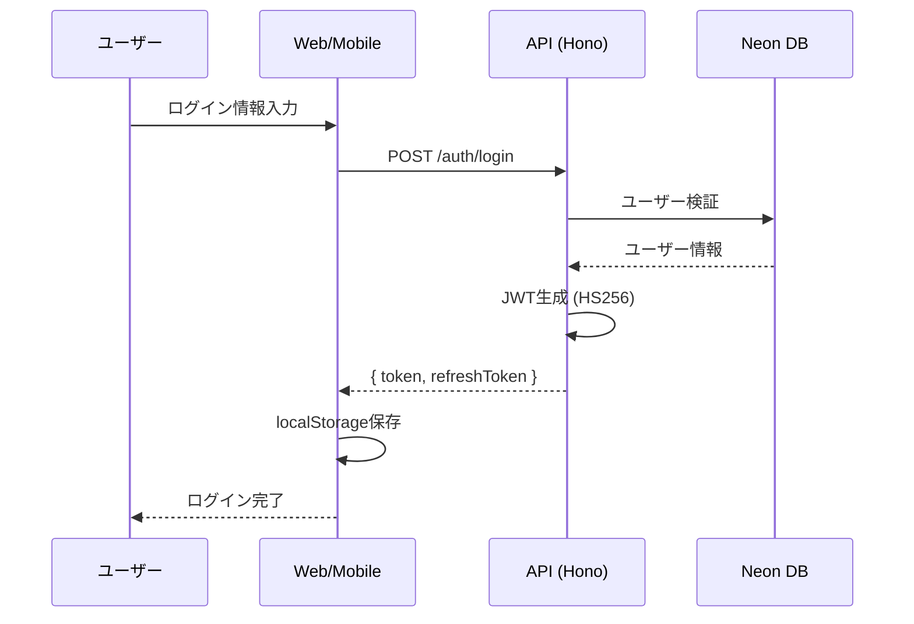
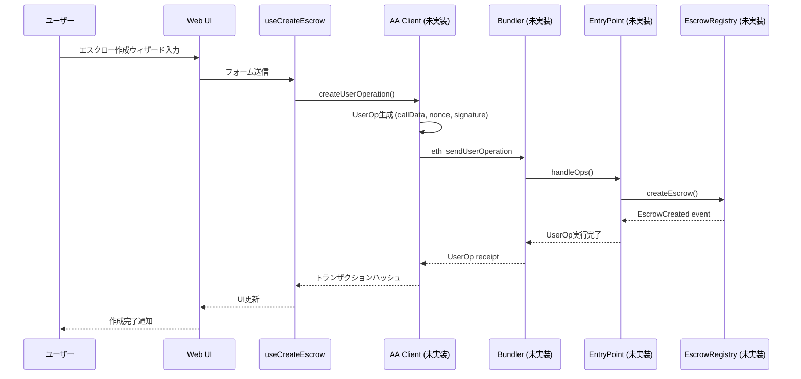
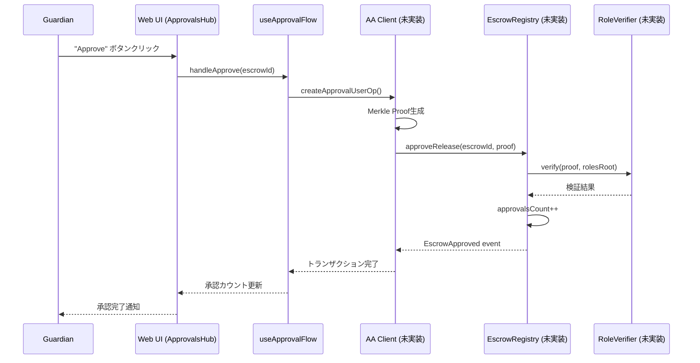
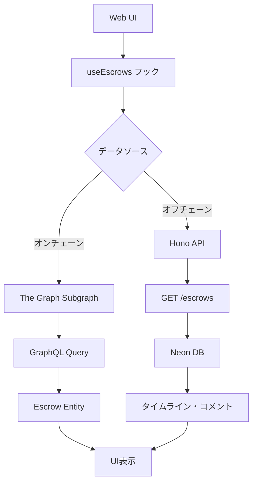
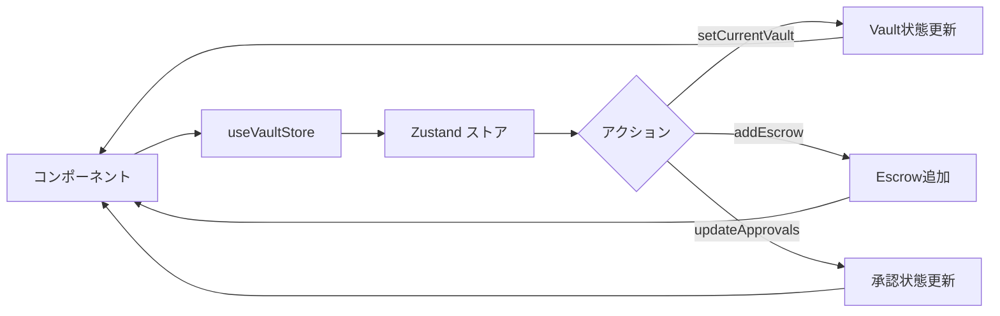
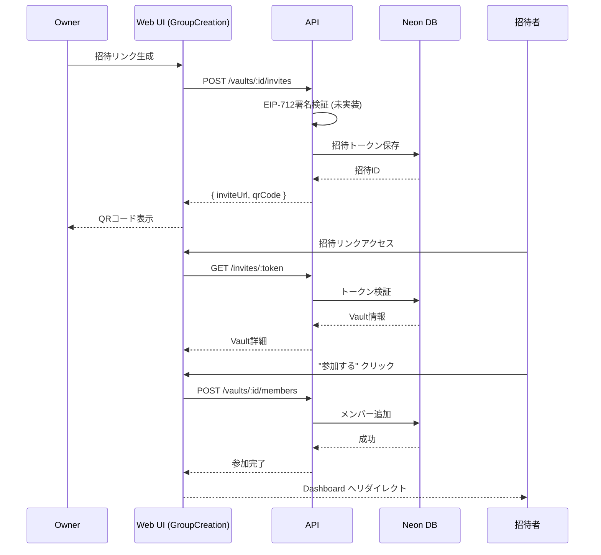
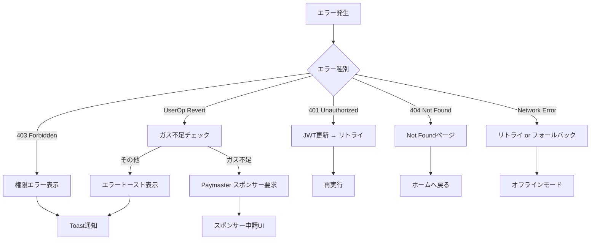
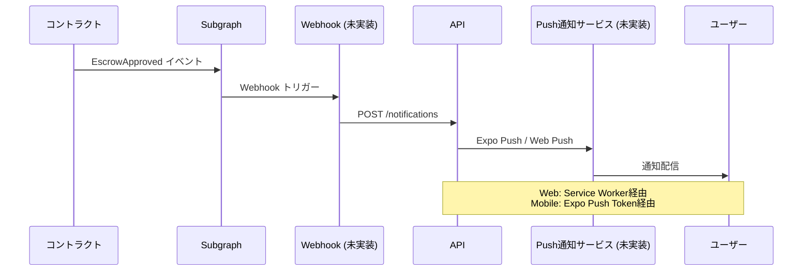

# データフロー図（逆生成）

## 認証フロー



## エスクロー作成フロー



## 承認フロー



## データ取得フロー（Subgraph統合）



## 状態管理フロー



## 招待フロー



## エラーハンドリングフロー



## 通知フロー



## リアルタイム更新フロー（計画）

```mermaid
flowchart LR
    A[Web UI] --> B[Polling<br/>5秒ごと]
    A --> C[WebSocket<br/>(未実装)]
    
    B --> D[GET /escrows/:id]
    D --> E[状態変化検出]
    E --> F[UI再レンダリング]
    
    C --> G[リアルタイム更新<br/>受信]
    G --> F
```
