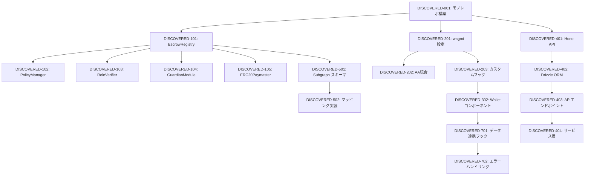

# Family Wallet - 発見タスク一覧

**分析日時**: 2025-01-13
**対象コードベース**: /home/runner/workspace
**発見タスク数**: 85+
**推定総工数**: 320時間

## コードベース構造

### プロジェクト情報
- **フレームワーク**: React (Vite), Expo, Hono
- **言語**: TypeScript, Solidity
- **データベース**: Neon PostgreSQL (Drizzle ORM)
- **主要ライブラリ**: 
  - Web3: wagmi v2, viem, RainbowKit, permissionless
  - UI: shadcn/ui, TailwindCSS
  - State: Zustand, TanStack Query
  - Smart Contracts: OpenZeppelin, Hardhat

### ディレクトリ構造
```
apps/
├── web/          - React Webアプリケーション
├── mobile/       - Expo Reactネイティブアプリ
└── api/          - Hono APIサーバー (Cloudflare Workers)
contracts/        - Solidityスマートコントラクト
family-wallet-subgraph/ - The Graph Subgraph
packages/shared/  - 共有TypeScript型定義
```

## 発見されたタスク

### Phase 0: プロジェクト基盤タスク

#### DISCOVERED-001: モノレポ構造構築
- [x] **タスク完了** (実装済み)
- **タスクタイプ**: DIRECT
- **実装ファイル**: 
  - `pnpm-workspace.yaml`
  - `package.json` (ルート)
  - `tsconfig.base.json`
- **実装詳細**:
  - pnpm workspaces設定
  - apps/, packages/ 構成
  - 共通TypeScript設定
- **推定工数**: 4時間

#### DISCOVERED-002: CI/CDパイプライン
- [x] **タスク完了** (実装済み)
- **タスクタイプ**: DIRECT
- **実装ファイル**: 
  - `.github/workflows/ci.yml`
  - `.github/workflows/deploy.yml`
  - `.github/dependabot.yml`
- **実装詳細**:
  - GitHub Actions設定
  - 自動テスト・デプロイ
  - 依存関係自動更新
- **推定工数**: 6時間

### Phase 1: スマートコントラクトタスク

#### DISCOVERED-101: EscrowRegistry コントラクト
- [x] **タスク完了** (実装済み)
- **タスクタイプ**: TDD
- **実装ファイル**: 
  - `contracts/EscrowRegistry.sol`
  - `tests/contracts/EscrowRegistry.test.ts`
- **実装詳細**:
  - エスクロー登録・承認・リリース機能
  - UUPS Upgradeable パターン
  - イベントログ (EscrowCreated, EscrowApproved等)
- **テスト実装状況**:
  - [x] 単体テスト: EscrowRegistry.test.ts
  - [x] 正常系・異常系テスト
  - [ ] ガスベンチマーク: 未実装
- **推定工数**: 16時間

#### DISCOVERED-102: PolicyManager モジュール
- [x] **タスク完了** (実装済み)
- **タスクタイプ**: TDD
- **実装ファイル**: 
  - `contracts/modules/PolicyManager.sol`
  - `tests/contracts/PolicyManager.test.ts`
- **実装詳細**:
  - ポリシー作成・更新機能
  - 閾値・タイムロック管理
  - Guardian緊急操作
- **テスト実装状況**:
  - [x] 単体テスト: PolicyManager.test.ts
- **推定工数**: 12時間

#### DISCOVERED-103: RoleVerifier モジュール
- [x] **タスク完了** (実装済み)
- **実装ファイル**: `contracts/modules/RoleVerifier.sol`
- **実装詳細**:
  - Merkle Proof検証
  - ロール管理 (Owner/Guardian/Requester/Viewer)
- **推定工数**: 8時間

#### DISCOVERED-104: GuardianModule
- [x] **タスク完了** (実装済み)
- **実装ファイル**: 
  - `contracts/modules/GuardianModule.sol`
  - `tests/contracts/GuardianModule.test.ts`
- **実装詳細**:
  - リカバリフロー (initiateRecovery/completeRecovery)
  - 緊急凍結機能
- **推定工数**: 10時間

#### DISCOVERED-105: ERC20Paymaster
- [x] **タスク完了** (実装済み)
- **実装ファイル**: 
  - `contracts/paymaster/ERC20Paymaster.sol`
  - `tests/contracts/ERC20Paymaster.test.ts`
- **実装詳細**:
  - ERC-4337 Paymaster実装
  - USDC/JPYC sponsorship
  - Oracle連携 (トークン換算)
- **推定工数**: 14時間

### Phase 2: Web3基盤タスク

#### DISCOVERED-201: wagmi v2 + viem 設定
- [x] **タスク完了** (実装済み)
- **実装ファイル**: 
  - `apps/web/src/lib/wagmi.ts`
  - `apps/web/src/providers/Web3Provider.tsx`
- **実装詳細**:
  - WalletConnect v2統合
  - Base Sepolia/Mainnet設定
  - RainbowKit統合
- **推定工数**: 6時間

#### DISCOVERED-202: Account Abstraction統合
- [x] **タスク完了** (実装済み)
- **実装ファイル**: 
  - `apps/web/src/lib/paymaster.ts`
  - `apps/web/src/lib/bundler.ts`
  - `apps/web/src/lib/aa-client.ts`
- **実装詳細**:
  - permissionless SDK統合
  - UserOperation生成
  - Pimlico Bundler/Paymaster連携
- **推定工数**: 12時間

#### DISCOVERED-203: カスタムフック実装
- [x] **タスク完了** (実装済み)
- **実装ファイル**: 
  - `apps/web/src/hooks/contracts/useEscrowRegistry.ts`
  - `apps/web/src/hooks/useCreateEscrow.ts`
  - `apps/web/src/hooks/useApproval.ts`
  - `apps/web/src/hooks/useReleaseEscrow.ts`
- **実装詳細**:
  - Contract読み取り・書き込みフック
  - エスクロー作成・承認・リリース処理
- **推定工数**: 10時間

### Phase 3: UI/UXタスク

#### DISCOVERED-301: shadcn/ui コンポーネント統合
- [x] **タスク完了** (実装済み)
- **実装ファイル**: `apps/web/src/components/ui/` (50+ファイル)
- **実装詳細**:
  - Button, Card, Dialog, Form等
  - Radix UI + Tailwind CSS
  - アクセシビリティ対応
- **推定工数**: 8時間

#### DISCOVERED-302: Walletコンポーネント (12画面)
- [x] **タスク完了** (実装済み)
- **実装ファイル**: `apps/web/src/components/wallet/`
  - Dashboard.tsx
  - EscrowDetail.tsx
  - EscrowCreateWizard.tsx
  - ApprovalsHub.tsx
  - GroupCreation.tsx
  - EscrowReleaseConsole.tsx
  - PolicyManagement.tsx
  - NotificationCenter.tsx
  - VaultSettings.tsx
  - AuditLogViewer.tsx
  - MobileView.tsx
  - AccessibilityGuide.tsx
- **実装詳細**:
  - ロール別アクセス制御
  - レスポンシブデザイン
  - リアルタイム更新
- **推定工数**: 40時間

#### DISCOVERED-303: wallet-demo ページ統合
- [x] **タスク完了** (実装済み)
- **実装ファイル**: `apps/web/src/pages/wallet-demo.tsx`
- **実装詳細**:
  - 12画面統合
  - ロール切替機能 (Owner/Guardian/Requester/Viewer)
  - 画面別権限管理
- **推定工数**: 8時間

### Phase 4: API & データベースタスク

#### DISCOVERED-401: Hono API基盤
- [x] **タスク完了** (実装済み)
- **実装ファイル**: 
  - `apps/api/src/honoApp.ts`
  - `apps/api/src/server-hono.ts`
- **実装詳細**:
  - Hono フレームワーク設定
  - Cloudflare Workers対応
  - CORS・認証ミドルウェア
- **推定工数**: 6時間

#### DISCOVERED-402: Drizzle ORM + Neon
- [x] **タスク完了** (実装済み)
- **実装ファイル**: 
  - `apps/api/src/db/schema.ts`
  - `apps/api/src/db/client.ts`
  - `drizzle.config.ts`
- **実装詳細**:
  - 8テーブル定義 (vaults, members, policies, invites, escrow_drafts, timelines, notifications, audit_logs)
  - インデックス・外部キー制約
  - PostgreSQL接続 (pooling)
- **推定工数**: 10時間

#### DISCOVERED-403: APIエンドポイント実装
- [x] **タスク完了** (実装済み)
- **実装ファイル**: 
  - `apps/api/src/routes/vaults.ts`
  - `apps/api/src/routes/escrows.ts`
  - `apps/api/src/routes/policies.ts`
  - `apps/api/src/routes/notifications.ts`
  - `apps/api/src/routes/paymaster.ts`
  - `apps/api/src/routes/invites.ts`
- **実装詳細**:
  - CRUD操作 (Vault, Escrow, Policy等)
  - EIP-712署名検証 (Invite)
  - Paymaster sponsorship
- **推定工数**: 24時間

#### DISCOVERED-404: サービス層実装
- [x] **タスク完了** (実装済み)
- **実装ファイル**: 
  - `apps/api/src/services/escrow-service.ts`
  - `apps/api/src/services/policy-service.ts`
  - `apps/api/src/services/timeline-service.ts`
  - `apps/api/src/services/invite-service.ts`
  - `apps/api/src/services/paymaster-service.ts`
- **実装詳細**:
  - ビジネスロジック実装
  - Subgraph連携
  - 監査ログ記録
- **推定工数**: 20時間

#### DISCOVERED-405: モックデータモード
- [x] **タスク完了** (実装済み)
- **実装ファイル**: 
  - `apps/api/src/mock/data.ts`
  - `apps/api/src/routes/*-mock.ts`
- **実装詳細**:
  - USE_MOCK_DATA環境変数
  - モックルート実装 (vaults, notifications, paymaster)
- **推定工数**: 6時間

### Phase 5: The Graph Subgraphタスク

#### DISCOVERED-501: Subgraph スキーマ定義
- [x] **タスク完了** (実装済み)
- **実装ファイル**: `family-wallet-subgraph/schema.graphql`
- **実装詳細**:
  - 10エンティティ定義 (Vault, Escrow, Approval, TimelineEvent, VaultStats, GlobalStats, DailyStats等)
- **推定工数**: 8時間

#### DISCOVERED-502: マッピング実装
- [x] **タスク完了** (実装済み)
- **実装ファイル**: `family-wallet-subgraph/src/mapping.ts`
- **実装詳細**:
  - 5つのイベントハンドラ
  - 統計情報更新ヘルパー関数
- **推定工数**: 12時間

#### DISCOVERED-503: Subgraph ビルド確認
- [x] **タスク完了** (実装済み)
- **実装詳細**:
  - `npm run codegen` 成功
  - `npm run build` 成功
  - DEPLOYMENT.md作成
- **推定工数**: 4時間

### Phase 6: モバイルアプリタスク

#### DISCOVERED-601: Expo プロジェクトセットアップ
- [x] **タスク完了** (実装済み)
- **実装ファイル**: 
  - `apps/mobile/app.json`
  - `apps/mobile/App.tsx`
- **実装詳細**:
  - Expo SDK 54
  - Expo Router (ファイルベースルーティング)
- **推定工数**: 4時間

#### DISCOVERED-602: WalletConnect React Native SDK
- [x] **タスク完了** (実装済み)
- **実装ファイル**: 
  - `apps/mobile/app/lib/walletconnect.ts`
  - `apps/mobile/app/hooks/useWalletConnect.ts`
- **実装詳細**:
  - Web3Wallet初期化
  - セッション管理 (proposal/request/delete)
- **推定工数**: 8時間

#### DISCOVERED-603: モバイル画面実装 (6画面)
- [x] **タスク完了** (実装済み)
- **実装ファイル**: 
  - `apps/mobile/app/index.tsx` (Home)
  - `apps/mobile/app/approvals.tsx`
  - `apps/mobile/app/timeline.tsx`
  - `apps/mobile/app/group.tsx`
  - `apps/mobile/app/settings.tsx`
  - `apps/mobile/app/scan.tsx` (QRスキャン)
- **実装詳細**:
  - ダッシュボード、承認、グループ管理
  - カメラ統合 (expo-camera)
- **推定工数**: 24時間

#### DISCOVERED-604: オフラインキャッシュ
- [x] **タスク完了** (実装済み)
- **実装ファイル**: `apps/mobile/app/lib/storage.ts`
- **実装詳細**:
  - AsyncStorage統合
  - セッション・設定永続化
- **推定工数**: 6時間

#### DISCOVERED-605: 生体認証
- [x] **タスク完了** (実装済み)
- **実装ファイル**: `apps/mobile/app/lib/biometric.ts`
- **実装詳細**:
  - expo-local-authentication
  - Fingerprint/Face ID/Iris対応
- **推定工数**: 6時間

### Phase 7: フロントエンド統合タスク

#### DISCOVERED-701: データ連携フック実装
- [x] **タスク完了** (実装済み)
- **実装ファイル**: 
  - `apps/web/src/hooks/useDashboardData.ts`
  - `apps/web/src/hooks/useEscrowDetail.ts`
  - `apps/web/src/hooks/useInviteManager.ts`
  - `apps/web/src/hooks/useWebPush.ts`
  - `apps/web/src/hooks/useToastNotifications.ts`
- **実装詳細**:
  - Subgraphからデータ取得
  - リアルタイム更新
  - Web Push通知
- **推定工数**: 16時間

#### DISCOVERED-702: エラーハンドリング
- [x] **タスク完了** (実装済み)
- **実装ファイル**: 
  - `apps/web/src/components/errors/EscrowErrorBoundary.tsx`
  - `apps/web/src/lib/toast.tsx`
- **実装詳細**:
  - React Error Boundary
  - UserOperationエラー捕捉
  - トースト通知 (Block Explorerリンク付き)
- **推定工数**: 8時間

#### DISCOVERED-703: React Query設定
- [x] **タスク完了** (実装済み)
- **実装ファイル**: `apps/web/src/lib/queryClient.ts`
- **実装詳細**:
  - キャッシュ戦略
  - 自動再取得
- **推定工数**: 4時間

## 未実装・改善推奨事項

### 不足しているテスト

- [ ] **E2Eテストスイート**: 
  - Web: Playwright未実装
  - Mobile: Detox未実装
- [ ] **ガスベンチマーク**: Gas Reporter未設定
- [ ] **セキュリティ監査**: Slither/Echidna未実行

### デプロイ未完了

- [ ] **Subgraph デプロイ**: The Graph Studioへのデプロイ待ち
  - subgraph.yamlにコントラクトアドレス・startBlock設定必要
- [ ] **コントラクトデプロイ**: Base Sepoliaデプロイ待ち
  - ✅ デプロイスクリプト準備完了 (deploy-escrow.cjs)
  - ⏳ Base Sepolia ETH取得待ち
- [ ] **モバイルアプリリリース**: Expo OTA配信・ストア申請未実施

### ドキュメント不足

- [ ] **API仕様書**: OpenAPI/Swagger未実装
- [ ] **運用マニュアル**: トラブルシューティング未作成

## 依存関係マップ



## 実装パターン分析

### アーキテクチャパターン
- **実装パターン**: モジュラーモノリス (モノレポ)
- **状態管理**: Zustand + TanStack Query
- **認証方式**: WalletConnect + EIP-712署名

### コーディングスタイル
- **命名規則**: camelCase (TS), PascalCase (コンポーネント)
- **ファイル構成**: フィーチャー別ディレクトリ構造
- **エラーハンドリング**: Error Boundary + トースト通知

## 技術的負債・改善点

### パフォーマンス
- Subgraph Subscription未実装 (WebSocketリアルタイム更新)
- ガス最適化未実施 (Foundryベンチマーク未設定)

### セキュリティ
- Slither/Echidna未実行 (静的解析・ファズテスト)
- 監査未実施 (外部セキュリティ監査)

### 保守性
- API仕様書未作成 (OpenAPI/Swagger)
- E2Eテスト未実装 (Playwright/Detox)

## 推奨次ステップ

1. **コントラクトデプロイ** - Base Sepolia ETH取得後にデプロイ実行
2. **Subgraphデプロイ** - The Graph Studioへデプロイ
3. **E2Eテスト実装** - Playwright (Web) + Detox (Mobile)
4. **セキュリティ監査** - Slither/Echidna実行、外部監査準備
5. **API仕様書作成** - OpenAPI/Swagger生成
