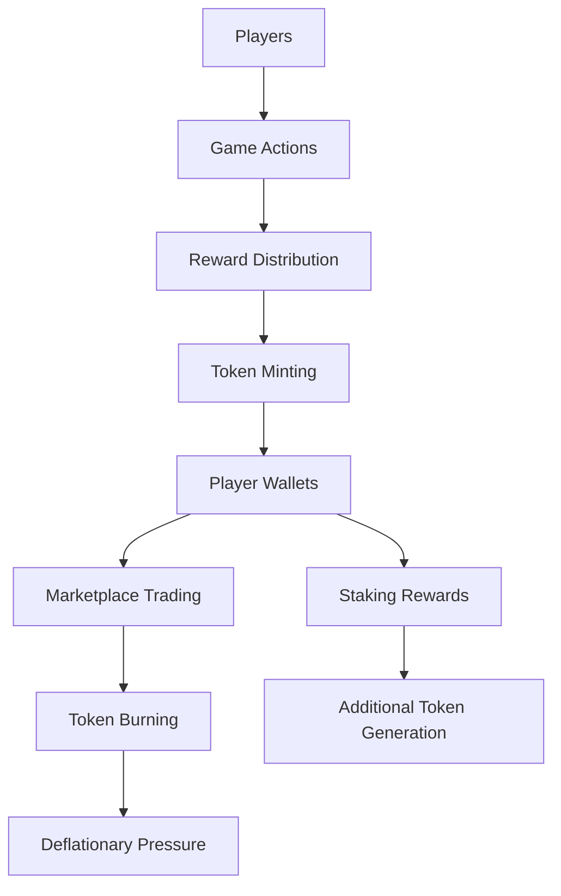

# GameFi/Web3 Gaming Template

## Project Configuration
- **Type**: Blockchain Gaming with Play-to-Earn Mechanics
- **Focus**: Game economies, NFT items, player rewards, asset interoperability
- **Standards**: ERC721 (items), ERC20 (game tokens), ERC1155 (multi-assets)

## Smart Contract Structure

### Core Contracts
1. **Game Token** (`contracts/GameToken.sol`)
   - ERC20 utility token for in-game currency
   - Reward distribution mechanics
   - Staking and burning mechanisms
   - Anti-inflation controls

2. **NFT Items** (`contracts/GameItems.sol`)
   - ERC1155 for multiple item types
   - Rarity and attribute systems
   - Upgrade and evolution mechanics
   - Cross-game compatibility

3. **Player Registry** (`contracts/PlayerRegistry.sol`)
   - Player profile management
   - Achievement tracking
   - Reputation system
   - Anti-sybil measures

4. **Game Mechanics** (`contracts/GameLogic.sol`)
   - Battle and competition systems
   - Reward calculation engines
   - Leaderboard management
   - Tournament organization

## AI Configuration

### Claude Prompts (Gaming-focused)
```markdown
@tdd-game-economy: Create comprehensive tests for game token economics and reward distribution
@tdd-game-items: Implement NFT item system with attributes, rarity, and upgrade mechanics
@tdd-game-battles: Build battle system with fair matchmaking and reward calculations
@tdd-game-marketplace: Design in-game marketplace with trading and auction functionality

Focus Areas:
- Game economy balance and sustainability
- Fair play mechanisms and anti-cheat systems
- Gas-efficient batch operations for game actions
- Cross-game asset interoperability standards
```

### Gemini Prompts (Game Design & Strategy)
```markdown
@kairo-game-economy: Design sustainable play-to-earn economy with balanced tokenomics
@kairo-game-progression: Plan player progression systems and achievement frameworks
@kairo-game-social: Develop guild systems and social interaction mechanics
@kairo-game-retention: Create player retention strategies and engagement mechanics

Requirements Focus:
- Player onboarding and education
- Game balance and fair competition
- Long-term engagement strategies
- Cross-platform compatibility planning
```

## Contract Implementation Templates

### Game Token with Anti-Inflation
```solidity
// SPDX-License-Identifier: MIT
pragma solidity ^0.8.19;

import "@openzeppelin/contracts/token/ERC20/ERC20.sol";
import "@openzeppelin/contracts/access/AccessControl.sol";
import "@openzeppelin/contracts/security/Pausable.sol";

contract GameToken is ERC20, AccessControl, Pausable {
    bytes32 public constant MINTER_ROLE = keccak256("MINTER_ROLE");
    bytes32 public constant BURNER_ROLE = keccak256("BURNER_ROLE");
    
    uint256 public constant MAX_SUPPLY = 1_000_000_000e18; // 1B tokens
    uint256 public constant DAILY_MINT_LIMIT = 100_000e18; // 100K per day
    
    uint256 public lastMintTimestamp;
    uint256 public dailyMinted;
    
    mapping(address => uint256) public playerRewards;
    mapping(address => uint256) public lastRewardClaim;
    
    constructor() ERC20("GameToken", "GAME") {
        _grantRole(DEFAULT_ADMIN_ROLE, msg.sender);
        _grantRole(MINTER_ROLE, msg.sender);
    }
    
    function mintReward(address player, uint256 amount) external onlyRole(MINTER_ROLE) {
        require(totalSupply() + amount <= MAX_SUPPLY, "Max supply exceeded");
        
        // Reset daily limit if new day
        if (block.timestamp >= lastMintTimestamp + 1 days) {
            dailyMinted = 0;
            lastMintTimestamp = block.timestamp;
        }
        
        require(dailyMinted + amount <= DAILY_MINT_LIMIT, "Daily mint limit exceeded");
        
        dailyMinted += amount;
        playerRewards[player] += amount;
        _mint(player, amount);
        
        emit RewardMinted(player, amount);
    }
    
    function burnFromPlayer(address player, uint256 amount) external onlyRole(BURNER_ROLE) {
        require(balanceOf(player) >= amount, "Insufficient balance");
        _burn(player, amount);
        
        emit TokensBurned(player, amount);
    }
    
    event RewardMinted(address indexed player, uint256 amount);
    event TokensBurned(address indexed player, uint256 amount);
}
```

### Game Items with Attributes
```solidity
// SPDX-License-Identifier: MIT
pragma solidity ^0.8.19;

import "@openzeppelin/contracts/token/ERC1155/ERC1155.sol";
import "@openzeppelin/contracts/access/AccessControl.sol";

contract GameItems is ERC1155, AccessControl {
    bytes32 public constant MINTER_ROLE = keccak256("MINTER_ROLE");
    bytes32 public constant UPGRADER_ROLE = keccak256("UPGRADER_ROLE");
    
    struct ItemType {
        string name;
        uint256 rarity; // 1-5 (common to legendary)
        uint256 category; // weapon, armor, consumable, etc.
        bool mintable;
    }
    
    struct ItemAttributes {
        uint256 attack;
        uint256 defense;
        uint256 speed;
        uint256 luck;
        uint256 level;
        bool isUpgraded;
    }
    
    mapping(uint256 => ItemType) public itemTypes;
    mapping(uint256 => mapping(uint256 => ItemAttributes)) public itemAttributes; // tokenId => serial => attributes
    mapping(uint256 => uint256) public itemSerialCounters;
    
    uint256 public nextItemTypeId = 1;
    
    constructor() ERC1155("https://game.example.com/api/item/{id}.json") {
        _grantRole(DEFAULT_ADMIN_ROLE, msg.sender);
        _grantRole(MINTER_ROLE, msg.sender);
        _grantRole(UPGRADER_ROLE, msg.sender);
    }
    
    function createItemType(
        string memory name,
        uint256 rarity,
        uint256 category
    ) external onlyRole(DEFAULT_ADMIN_ROLE) returns (uint256) {
        uint256 itemTypeId = nextItemTypeId++;
        itemTypes[itemTypeId] = ItemType({
            name: name,
            rarity: rarity,
            category: category,
            mintable: true
        });
        
        return itemTypeId;
    }
    
    function mintItem(
        address to,
        uint256 itemTypeId,
        uint256 attack,
        uint256 defense,
        uint256 speed,
        uint256 luck
    ) external onlyRole(MINTER_ROLE) returns (uint256) {
        require(itemTypes[itemTypeId].mintable, "Item type not mintable");
        
        uint256 serialNumber = itemSerialCounters[itemTypeId]++;
        uint256 tokenId = itemTypeId * 1e6 + serialNumber; // Unique token ID
        
        itemAttributes[itemTypeId][serialNumber] = ItemAttributes({
            attack: attack,
            defense: defense,
            speed: speed,
            luck: luck,
            level: 1,
            isUpgraded: false
        });
        
        _mint(to, tokenId, 1, "");
        
        emit ItemMinted(to, itemTypeId, tokenId, serialNumber);
        return tokenId;
    }
    
    function upgradeItem(uint256 itemTypeId, uint256 serialNumber) 
        external onlyRole(UPGRADER_ROLE) {
        ItemAttributes storage attrs = itemAttributes[itemTypeId][serialNumber];
        require(attrs.level > 0, "Item does not exist");
        require(attrs.level < 10, "Max level reached");
        
        // Upgrade stats (10% increase per level)
        attrs.attack = attrs.attack * 110 / 100;
        attrs.defense = attrs.defense * 110 / 100;
        attrs.speed = attrs.speed * 110 / 100;
        attrs.luck = attrs.luck * 110 / 100;
        attrs.level++;
        attrs.isUpgraded = true;
        
        emit ItemUpgraded(itemTypeId, serialNumber, attrs.level);
    }
    
    event ItemMinted(address indexed to, uint256 indexed itemTypeId, uint256 tokenId, uint256 serialNumber);
    event ItemUpgraded(uint256 indexed itemTypeId, uint256 serialNumber, uint256 newLevel);
}
```

## Test Cases Template

### Critical Gaming Test Scenarios
1. **Economy Tests**
   - Token inflation/deflation balance
   - Reward distribution fairness
   - Anti-farming mechanism validation
   - Supply cap enforcement

2. **Item System Tests**
   - NFT minting and attribute assignment
   - Upgrade mechanism validation
   - Rarity distribution verification
   - Cross-game compatibility testing

3. **Gameplay Tests**
   - Battle outcome determinism
   - Leaderboard accuracy
   - Achievement unlock validation
   - Anti-cheat mechanism verification

4. **Marketplace Tests**
   - Item trading functionality
   - Price discovery mechanisms
   - Auction system validation
   - Fee calculation accuracy

## Frontend Integration

### Key Components
1. **Game Interface**
   - Player dashboard with stats
   - Inventory management
   - Battle/competition interface
   - Real-time game state updates

2. **Marketplace**
   - Item browsing and filtering
   - Buy/sell functionality
   - Auction participation
   - Price history tracking

3. **Social Features**
   - Guild management
   - Friend systems
   - Chat integration
   - Tournament brackets

4. **Wallet Integration**
   - Asset management
   - Transaction history
   - Reward tracking
   - Cross-game asset viewing

## Game Economy Design

### Token Flow Architecture


### Reward Calculation System
```solidity
contract RewardCalculator {
    struct PlayerStats {
        uint256 level;
        uint256 experience;
        uint256 winRate;
        uint256 consecutiveWins;
        uint256 totalGamesPlayed;
    }
    
    mapping(address => PlayerStats) public playerStats;
    
    function calculateBattleReward(
        address winner,
        address loser,
        uint256 battleDuration,
        bool isRanked
    ) external view returns (uint256) {
        PlayerStats memory winnerStats = playerStats[winner];
        PlayerStats memory loserStats = playerStats[loser];
        
        // Base reward calculation
        uint256 baseReward = 10e18; // 10 tokens
        
        // Level difference bonus/penalty
        if (loserStats.level > winnerStats.level) {
            baseReward = baseReward * (100 + (loserStats.level - winnerStats.level) * 5) / 100;
        } else if (winnerStats.level > loserStats.level) {
            baseReward = baseReward * (100 - (winnerStats.level - loserStats.level) * 2) / 100;
        }
        
        // Consecutive wins bonus
        if (winnerStats.consecutiveWins >= 5) {
            baseReward = baseReward * 120 / 100; // 20% bonus
        }
        
        // Ranked match bonus
        if (isRanked) {
            baseReward = baseReward * 150 / 100; // 50% bonus
        }
        
        // Anti-farming: reduce rewards for very short battles
        if (battleDuration < 60) {
            baseReward = baseReward * 50 / 100; // 50% penalty
        }
        
        return baseReward;
    }
}
```

## Security Checklist

### Gaming-Specific Security Measures
- [ ] Anti-cheat mechanisms for game logic
- [ ] Randomness manipulation prevention
- [ ] Bot and automation detection
- [ ] Sybil attack resistance
- [ ] Economic exploit prevention
- [ ] Cross-game asset validation
- [ ] Player data privacy protection
- [ ] Reward distribution fairness
- [ ] Marketplace transaction security
- [ ] Emergency pause mechanisms for game systems

## Launch Strategy

### Game Development Phases
1. **Alpha Phase**
   - Core gameplay mechanics
   - Basic NFT item system
   - Simple reward distribution
   - Closed testing group

2. **Beta Phase**
   - Advanced game features
   - Marketplace integration
   - Guild system implementation
   - Open beta testing

3. **Launch Phase**
   - Full feature deployment
   - Marketing campaign execution
   - Community events
   - Partnership activations

### Player Onboarding
1. **Tutorial System**
   - Wallet setup guidance
   - Basic gameplay education
   - NFT and token explanation
   - First transaction support

2. **Incentive Programs**
   - New player bonuses
   - Daily login rewards
   - Achievement unlocks
   - Referral systems

## Cross-Game Interoperability

### Asset Standards
```solidity
interface IGameAsset {
    function getAssetData(uint256 tokenId) external view returns (
        uint256 category,
        uint256 rarity,
        uint256[] memory attributes,
        bytes memory metadata
    );
    
    function isTransferableToGame(address gameContract) external view returns (bool);
    function onGameTransfer(uint256 tokenId, address from, address to) external;
}

contract CrossGameBridge {
    mapping(address => bool) public authorizedGames;
    mapping(uint256 => address) public assetOrigins;
    
    function transferAssetToGame(
        address fromGame,
        address toGame,
        uint256 tokenId
    ) external {
        require(authorizedGames[fromGame] && authorizedGames[toGame], "Unauthorized game");
        
        IGameAsset(fromGame).safeTransferFrom(msg.sender, address(this), tokenId);
        IGameAsset(toGame).mintCrossGameAsset(msg.sender, tokenId, fromGame);
        
        assetOrigins[tokenId] = fromGame;
    }
}
```

## Integration Guidelines

This template provides:
- Complete gaming economy infrastructure with anti-inflation controls
- NFT item system with attributes and upgrade mechanics
- AI prompts optimized for game development challenges
- Player progression and reward systems
- Cross-game asset interoperability framework
- Anti-cheat and fair play mechanisms

Use this template when creating:
- Play-to-earn games
- NFT-based RPGs
- Competitive gaming platforms
- Virtual world economies
- Cross-game asset ecosystems